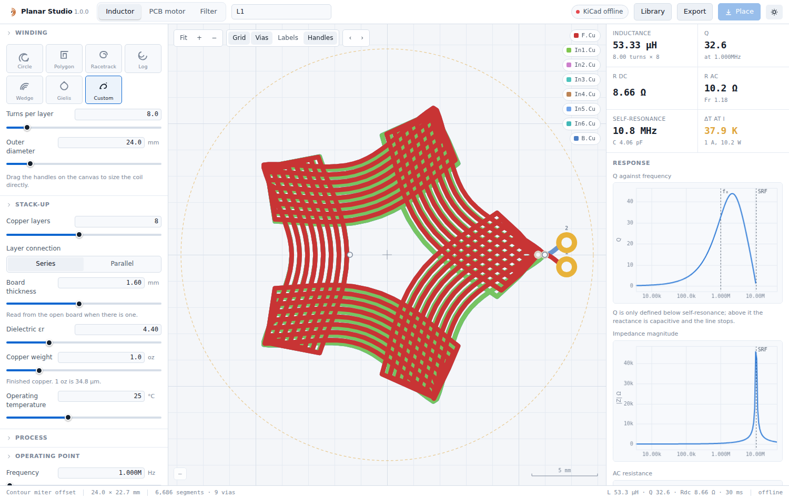
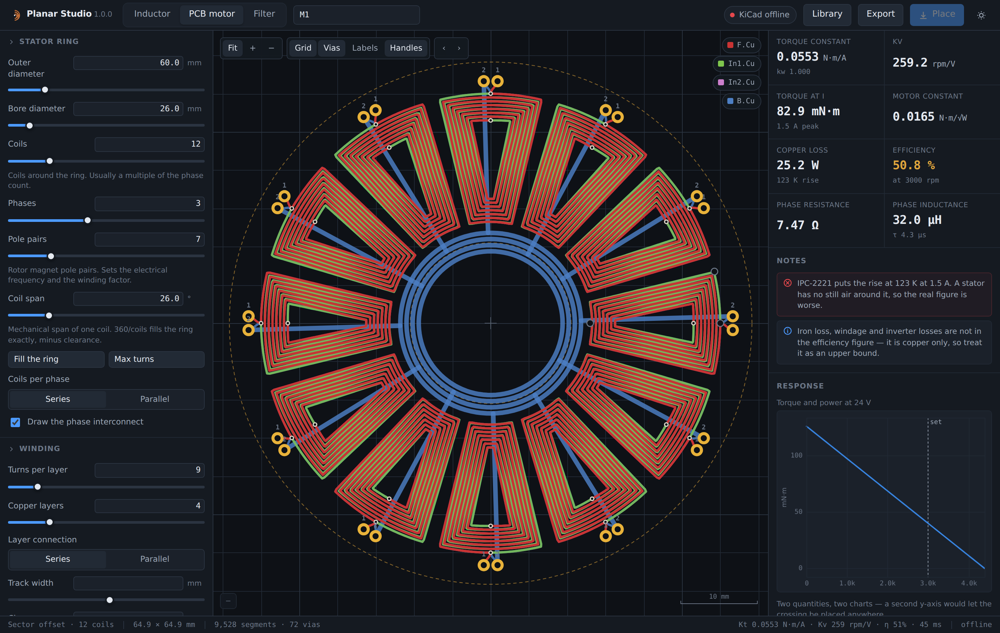
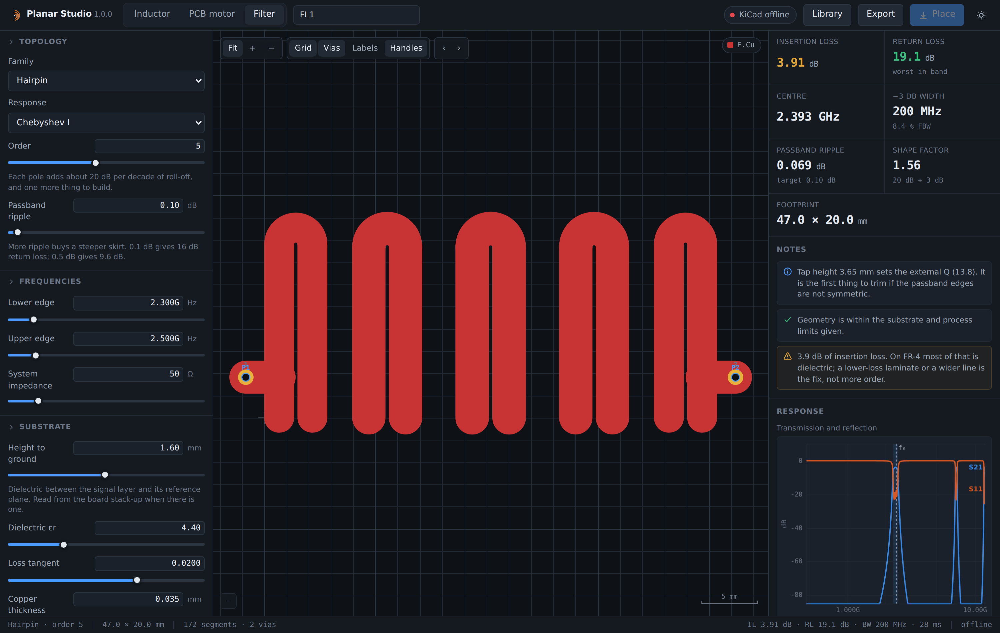
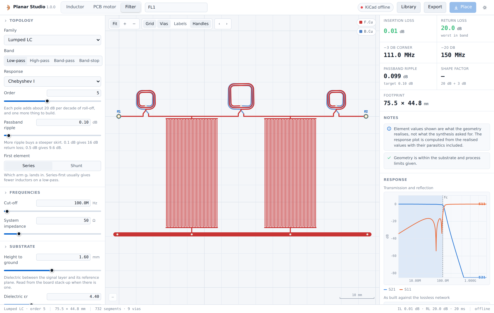

# Planar Studio

[](https://github.com/jonahsaunders/planar-studio/actions/workflows/ci.yml)
[](https://www.kicad.org/)
[](LICENSE)

A KiCad extension for the copper you cannot buy as a part: planar inductors,
axial-flux PCB motor stators, and planar filters. It reads the open board's
stack-up, solves the electromagnetics numerically, and writes real tracks,
arcs and vias into that board in one undoable commit.

Built on the engine from [planar-coil-studio][pcs], moved inside KiCad and
extended with a filter synthesis and layout stack.



[pcs]: https://github.com/jonahsaunders/planar-coil-studio

---

## What it does

Three workspaces over one geometry and one solver.

**Inductor.** Seven winding families, 1 to 16 copper layers in series or
parallel, with correct mirrored stacking and automatic transition vias. Full
electrical model: inductance, DC and AC resistance, parasitic capacitance,
self-resonance, Q, IPC-2221 current rating and temperature rise.

**PCB motor.** Sector coils tiled around a ring with the phase interconnect
drawn — concentric buses in the bore, one ring per phase plus a star point.
Sinusoidal PMSM model: winding factor, flux linkage, K<sub>t</sub>,
K<sub>e</sub>, K<sub>v</sub>, motor constant, and the torque–speed line at a
bus voltage.



**Filter.** Six families, synthesised from a prototype and laid out as copper:

| Family | What it is | Where it belongs |
|---|---|---|
| Lumped LC | Spiral inductors and planar capacitors in a ladder | DC to a few hundred MHz |
| Stepped impedance | Alternating wide and narrow line sections | Microstrip low-pass, any RF band |
| Edge-coupled | Parallel half-wave resonators | The default microstrip band-pass |
| Hairpin | The same synthesis, resonators folded into a U | About a third the length |
| Interdigital | Quarter-wave resonators grounded at alternating ends | Compact, no spur at 2·f₀ |
| EMI / power | Pi, T and common-mode networks | Mains and DC-bus filtering |

Butterworth, Chebyshev and Bessel prototypes; low-pass, high-pass, band-pass
and band-stop transforms; S-parameters, VSWR and group delay from an ABCD
cascade.



## How it integrates

This is an IPC API plugin, which means it runs as its own process with its own
managed virtual environment and talks to KiCad over a socket. Two consequences,
both good.

**The interface is not limited to KiCad's bundled wxPython.** The plugin serves
its own page on loopback and opens it in a native window (or your browser if no
webview runtime is present). That is where the live canvas, the direct
manipulation handles and the response plots come from.

**The board is a live input, not an assumption.** When a PCB is open, Planar
Studio reads its stack-up and adopts it: layer count, board thickness,
dielectric constant and copper weight become the board's real numbers, and it
says so rather than changing them silently. Copper is placed onto the layers
that board actually has, so a four-layer coil on a ten-layer board lands where
you meant it to.

Placement is one commit. A 4,000-segment winding is a single Ctrl+Z. Re-placing
a design you have placed before offers to replace the previous copper rather
than stacking a second winding on top of it — the plugin remembers which board
items belonged to which design.

### What it cannot do, and why

The IPC API has no way to create a net. A net exists because the schematic says
so. Copper placed by a plugin therefore joins a net that already exists, by
name, or carries none — which is exactly what KiCad does for track you draw by
hand on an unassigned net. Create the net in the schematic first if you want
one.

A plugin also cannot create a pad outside a footprint, so terminals are placed
as through-hole vias. If you want real pads, use **Library**: it writes a
`.kicad_mod` into a project-local `planar-studio.pretty` folder and registers it
in the project's footprint library table, and you place it like any other
footprint.

## The solver

Inductance is a partial-inductance sum over the discretised 3-D filament path —
the Neumann double integral with a geometric-mean-distance kernel, self terms
from Grover's straight-bar expression, plus a discretisation correction that is
recalibrated for the segment length and cross-section on every solve.

Because the whole multi-layer path (including via barrels) is one filament
chain, inter-layer mutual inductance falls out of the same sum rather than
being bolted on as a coupling coefficient.

`tests/verify.mjs` checks it against cases with known answers:

| Case | Reference | Result |
|---|---|---|
| Single circular loop | `µ₀R(ln(8R/GMD) − 2)` | **0.04 %** |
| Two coaxial loops, 1 mm apart | Maxwell's elliptic-integral mutual | **0.29 %** |
| Square planar spirals | Mohan current-sheet expression | **3.1 – 7.3 %** |
| Circular planar spirals | Mohan current-sheet expression | **1.4 – 2.3 %** |
| 50 Ω on 1.6 mm FR-4 | Published width | **1.3 %** |
| Coupled Z0e/Z0o, w 1.5 s 0.3 | Published tables | **0.4 / 3.0 %** |
| Chebyshev g-values | Matthaei tables | **< 0.01 %** |
| Interdigital insertion loss | `4.343·Σg/(FBW·Q_u)` | **1.1 – 4.5 %** |

The Mohan expression carries roughly ±3–8 % of its own error, so those two rows
are agreement, not deviation. The tool shows the numerical and closed-form
values side by side wherever a closed form exists.

## Models

| Quantity | Model |
|---|---|
| Inductance | Partial inductance, Neumann + GMD kernel; Grover self terms |
| Closed-form cross-check | Mohan current-sheet and modified Wheeler, where the shape has coefficients |
| AC resistance | Dowell, with porosity correction `η = w/(w+s)` |
| Interlayer capacitance | Plate capacitance with the 1/3 energy factor for a series stack |
| Turn-to-turn capacitance | Coplanar strips on substrate, scaled by `(n−1)/n²` |
| Current rating | IPC-2221, `I = k·ΔT^0.44·A^0.725`, `k` = 0.048 external / 0.024 internal |
| Motor | Sinusoidal PMSM: `Kt = 1.5·p·λ`, `λ = N·kw·Φ`, `Φ = (2/π)·B·A_pole` |
| Microstrip | Hammerstad–Jensen with thickness correction; Getsinger dispersion |
| Coupled microstrip | Modal capacitance decomposition (Garg & Bahl) |
| Filter prototypes | Matthaei/Pozar g-values; standard LP/HP/BP/BS transforms |
| Filter response | ABCD cascade → S-parameters, with realised parasitics |
| Interdigital capacitor | Coplanar-strip conformal mapping, `(N−1)` gaps in parallel |

Airgap flux density is an input, not a magnetostatic solve — feed it from your
magnet grade and gap. IPC-2221 assumes still air and an isolated conductor; a
coil packed against its neighbours runs hotter than the single-trace figure, and
a stator has no still air around it at all.

## Four things the engineering gets right

Worth knowing if you extend it, because all four are easy to get wrong.

**Series layers must be mirrored, not just reversed.** Traversing the same
spiral backwards on the next layer reverses the circulation and the layers
cancel instead of adding. Alternate layers are therefore mirrored about the X
axis — and every generator starts and ends on the +X ray so the mirror maps the
connection point onto itself. Transition vias land on a shared point with zero
jumper trace.

**Inductance is not a smooth function of fractional turns.** A spiral that stops
three-quarters of the way round ends at an arbitrary angle: the lead breakout
swings to a different side, the terminal may or may not end up enclosed by its
own turns, and the transition via lands elsewhere on the layer below. L can jump
30 % between 1.70 and 1.75 turns and then fall again. So the inverse solver — the
one that sizes a coil for a target inductance — searches over *whole* turns and
then trims the diameter, both of which are monotonic. A bisection on the turn
count converges confidently to the wrong answer.

**A resonator's unloaded Q is a parallel conductance, not a series resistance in
each arm.** Modelling it as series loss in both the L and the C roughly doubles
it and then compounds the error through the parallel combination, which is how a
filter that should show 3 dB of insertion loss comes out showing 14. On FR-4 the
dielectric alone caps Q<sub>u</sub> at 1/tan δ ≈ 50, and the tool computes it
from the line's own loss rather than from a slider.

**Bandwidth has to be measured from the crossings that bracket the peak.** An
edge-coupled filter has a second passband near 2·f₀ and a stepped-impedance
low-pass re-enters above its first section resonance. Measuring from the first
crossing in the sweep to the last spans both and reports a bandwidth tens of
times too wide. Equal-ripple filters have the mirror-image problem for centre
frequency: several maxima of identical height, so "the peak frequency" is
whichever one wins on floating-point noise. The centre comes from the band-edge
pair instead.

## The filter pipeline

A prototype becomes a network, the network becomes copper, and the copper is
simulated back. The last step is the one that matters: the plotted response is
computed from the geometry that would be placed — a spiral's realised
inductance and its measured Q, a capacitor's series inductance — not from the
ideal components the synthesis asked for. Both curves are drawn. The prototype
is what you asked for; the built response is what the board does, and the gap
between them is usually the most useful thing on the screen.



Layouts are the textbook forms, not optimised ones. A parallel-coupled filter
built from first-order synthesis lands a percent or two low in centre frequency
and, before its own loss narrows it again, 10–25 % wide in bandwidth. That is a
property of the synthesis, and the response plot shows it rather than quietly
retuning the geometry to hide it.

## Install

**From the Plugin and Content Manager.** Point PCM at a repository that hosts
`planar-studio-1.0.0.zip`, or use *Install from File* on the archive built by
`./build.sh`.

**By hand.** Copy this folder into KiCad's plugin directory as
`planar-studio`:

| Platform | Path |
|---|---|
| Linux | `~/.local/share/kicad/9.0/plugins/planar-studio` |
| macOS | `~/Documents/KiCad/9.0/plugins/planar-studio` |
| Windows | `%USERPROFILE%\Documents\KiCad\9.0\plugins\planar-studio` |

or run `./build.sh --install <that directory's parent>`.

Restart KiCad. The toolbar button appears in the PCB editor once KiCad has
built the plugin's virtual environment and installed `kicad-python` into it,
which takes a moment the first time.

Requires **KiCad 9.0 or newer** — the IPC API does not exist before it, and the
old SWIG bindings this does not use were removed in KiCad 11.

## Run it outside KiCad

The whole design tool works with no KiCad at all. Everything computes and every
export works; only the board actions report that there is nothing to talk to.

```sh
python3 ipc_entry.py --browser --verbose
```

Useful for development, and for showing someone a design on a machine that has
no KiCad on it.

## Layout

```
plugin.json           IPC API manifest — identifier, runtime, toolbar action
ipc_entry.py          entry point KiCad launches
requirements.txt      kicad-python, plus an optional native-window backend
metadata.json         Plugin and Content Manager package description
build.sh              assembles the PCM archive

planar_studio/
  app.py              the RPC surface and the process lifecycle
  kicad_link.py       everything that touches kipy — the only file that does
  server.py           loopback HTTP server, token auth, static assets
  window.py           native window, with the browser as a first-class fallback
  library.py          .kicad_mod writer and fp-lib-table registration
  store.py            preferences, saved designs, placement registry

web/
  index.html          the shell
  css/app.css         the design language, light and dark
  js/
    app.js            state, recompute scheduling, actions
    bridge.js         the page's half of the plugin conversation
    engine/
      coil.js         geometry generators, stack-up, EM solver
      coilgeom.js     windings and stator rings into artwork
      filter.js       prototypes, transforms, topologies, S-parameters
      filtergeom.js   synthesised networks into copper
      microstrip.js   Hammerstad–Jensen, coupled lines, planar passives
      complex.js      complex arithmetic and ABCD matrices
      artwork.js      the one geometry format everything downstream reads
      exporters.js    .kicad_mod, .kicad_pcb, SVG, DXF, JSON, spec sheet
    ui/
      canvas.js       viewport, rendering, direct manipulation
      charts.js       response plots
      controls.js     declarative parameter panels
    ws/
      inductor.js     the three workspaces: parameters, readouts, charts
      motor.js
      filter.js

tests/
  verify.mjs          numerical validation against known answers
  smoke.mjs           headless pass through every workspace and family
```

## Verify

```sh
node tests/verify.mjs      # 104 numerical checks, no dependencies
node tests/rpc.mjs         # 26 checks on the plugin's RPC surface
node tests/smoke.mjs       # headless UI pass (needs playwright)
node tests/shots.mjs       # regenerate the screenshots in docs/
```

`verify.mjs` runs against the engine directly and needs nothing installed.
`rpc.mjs` drives the Python side with no KiCad on the other end, which is the
state most likely to be wrong in the field: it checks the token on every route,
that persistence round-trips, that a file save cannot escape its directory, and
that every board method fails with a sentence rather than a traceback when the
PCB window is closed. `smoke.mjs` starts the real plugin server, drives the real
page in headless Chromium, and fails on any console error or workspace that does
not produce geometry.

## Export

Placing into the open board is the normal path. The other formats exist for
what it does not cover:

- **`.kicad_mod`** — copper as footprint graphics with through-hole terminals.
  **Library** writes it into the project and registers it; **Export** saves it
  wherever you like.
- **`.kicad_pcb`** — real tracks, vias and nets with a full layer table. *File →
  Open*, or *File → Append Board*. Take this one if you want the design as a
  standalone board.
- **SVG** and **DXF R12** — documentation, mechanical CAD, and FEA meshing
  (FEMM, Ansys).
- **JSON** — every parameter and the computed results. Reload it, or diff two
  revisions.
- **Specification sheet** — a Markdown table of every quantity, with the models
  and their limits named.

The export tolerance is a real distance: no copper edge moves further than it
when a path is simplified. The status bar shows the segment count before you
commit, because a board editor gets unpleasant above about 20,000 track
segments and it is better to know first.

## Security

The plugin serves its page on loopback only, and every request carries a
per-session token — as a header for the page's own calls, as a cookie for
stylesheets and modules. Without it, any page open in another tab could POST
geometry into your board. The page's Content-Security-Policy forbids inline
script and every external origin, so nothing it loads comes from the network.

## References

- Mohan, Hershenson, Boyd & Lee. *Simple accurate expressions for planar spiral
  inductances.* IEEE J. Solid-State Circuits 34(10), 1999.
- Greenhouse. *Design of planar rectangular microelectronic inductors.* IEEE
  Trans. Parts, Hybrids and Packaging 10(2), 1974.
- Grover. *Inductance Calculations: Working Formulas and Tables.* Dover, 1946.
- Dowell. *Effects of eddy currents in transformer windings.* Proc. IEE 113(8),
  1966.
- IPC-2221B, *Generic Standard on Printed Board Design*, §6.2.
- Hammerstad & Jensen. *Accurate models for microstrip computer-aided design.*
  IEEE MTT-S, 1980.
- Getsinger. *Microstrip dispersion model.* IEEE Trans. MTT-21, 1973.
- Gupta, Garg, Bahl & Bhartia. *Microstrip Lines and Slotlines*, 2nd ed.
- Bahl. *Lumped Elements for RF and Microwave Circuits*, 2003.
- Matthaei, Young & Jones. *Microwave Filters, Impedance-Matching Networks and
  Coupling Structures*, 1980.
- Pozar. *Microwave Engineering*, 4th ed., ch. 8.
- Hong. *Microstrip Filters for RF/Microwave Applications*, 2nd ed., 2011.
- Gielis. *A generic geometric transformation that unifies a wide range of
  natural and abstract shapes.* American Journal of Botany 90(3), 2003.

## Licence

MIT — see [LICENSE](LICENSE).
