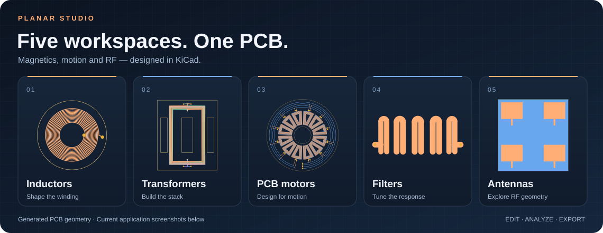

# Planar Studio

Design planar inductors, transformers, PCB motors, filters and antennas inside
KiCad. Planar Studio reads your board's stack, calculates electrical estimates,
and places the generated copper into the PCB as one undoable operation.

**[Download v1.6.0](https://github.com/jonahsaunders/planar-studio/releases/download/v1.6.0/planar-studio-1.6.0.zip)**
· [Install](#install) · [Guides](#guides) · [Flyback example](#5-w-planar-flyback-example) · [GaN example](#60-w-gan-planar-llc-example)

## Explore the workspaces

Current application captures. Click a view to open the full-size image.

<table>
<tr>
<td width="50%" valign="top">
<h3>Inductors</h3>

Shape windings, connect layers and route around obstacles. <a href="docs/winding-obstacles.md">Winding guide →</a>

</td>
<td width="50%" valign="top">
<h3>Transformers</h3>

Build ferrite stacks, compare candidates and verify operating limits. <a href="docs/transformer-design.md">Transformer guide →</a>

</td>
</tr>
<tr>
<td width="50%" valign="top">
<h3>PCB motors</h3>

Explore rotary, stepper, linear, dual-rotor and planar machines. <a href="docs/gallery.md#pcb-motors">See all five motor families →</a>

</td>
<td width="50%" valign="top">
<h3>Filters</h3>

Turn LC and microstrip networks into copper and response plots. <a href="docs/engineering-models.md#filter-families">Filter models →</a>

</td>
</tr>
<tr>
<td width="50%" valign="top">
<h3>Antennas</h3>

Design patches, arrays, directional radiators and NFC loops. <a href="docs/gallery.md#antennas">Explore antenna layouts →</a>

</td>
<td width="50%" valign="top">
<h3>Design tools</h3>

Inspect fields, optimize geometry and compare measurements. <a href="docs/design-tools.md">Design tools guide →</a>

</td>
</tr>
</table>

**[Open the full 15-image gallery →](docs/gallery.md)** — obstacle routing,
transformer search, motor families, antenna variants and both interface themes.

Save editable designs, compare calculated responses, and export KiCad boards or
footprints, SVG, DXF, JSON and specification sheets. The **Design tools** panel
adds constrained searches, measurement overlays, tolerance studies and board
checks; see the [tools guide](docs/design-tools.md).

## Install

The **1.6.0 development release** supports KiCad **9.0.1 or newer** on Windows,
macOS and Linux. [Release notes](https://github.com/jonahsaunders/planar-studio/releases/tag/v1.6.0).

1. Download [planar-studio-1.6.0.zip](https://github.com/jonahsaunders/planar-studio/releases/download/v1.6.0/planar-studio-1.6.0.zip) and leave it zipped.
2. In KiCad's main Project Manager, open **Plugin and Content Manager**.
3. Choose **Install from File**, select the ZIP and apply pending changes.
4. Restart KiCad, open the PCB Editor, and launch **Planar Studio** after its
   Python environment finishes setting up.

Upgrading or getting a metadata error?

To upgrade, close Planar Studio and the PCB Editor. In **Plugin and Content
Manager → Installed**, uninstall the old version and apply pending changes
before installing the new ZIP. Saved designs are stored separately; preserve
the settings folder.

Use the installer linked above. GitHub's **Code → Download ZIP** and **Source
code** archives contain the repository, not a PCM installer.

## 5 W planar flyback example

An **18–36 V DC to isolated 5 V / 1 A** converter with an LT8302 controller and
transformer windings built into a six-layer PCB. The example includes a KiCad 10
project, schematic, BOM, calculations and single-board manufacturing files for
JLCPCB-managed panelization.

**Unbuilt engineering prototype.** Factory acceptance and electrical, thermal
and magnetic qualification remain open.

[Explore the board and schematic](examples/planar-flyback-5w/README.md)
· [Review package](examples/PS-FLYBACK-5W-A5-review-package.zip)
· [Validation record](examples/planar-flyback-5w/VALIDATION.md)

## 60 W GaN planar LLC example

A **48 V nominal to isolated 12 V / 5 A target** using an integrated GaN half
bridge, silicon synchronous rectifiers and an eight-layer PCB transformer.
The 80 × 58 mm chamfered board has all electronics on top, polarized XT30 ports,
and the flyback example's exposed-substrate M3 hole geometry on a 71 × 49 mm
pattern. The accompanying MIT PER study explains the layout decisions.

**Unbuilt engineering prototype.** ERC, DRC, connectivity, assembly-file agreement
and a portable rebuild pass. Factory DFM, ferrite installation and electrical,
magnetic and thermal qualification remain open. 60 W is not a measured result.

[Explore the native KiCad example](examples/planar-gan-60w/README.md)
· [KiCad package](examples/PS-GAN-60W-A1-KiCad.zip)
· [PER design study](examples/planar-gan-60w/PER-DESIGN-STUDY.md)
· [Validation record](examples/planar-gan-60w/VALIDATION.md)

## Guides

- [Design tools](docs/design-tools.md) — optimization, measurements, tolerances and board checks.
- [Layer setup and loaded transformers](docs/stack-load-antennas.md) — board layers, winding stacks and source/load models.
- [Directional antennas](docs/directional-antennas.md) — Vivaldi, Yagi, log-periodic and bow-tie layouts.
- [Engineering models](docs/engineering-models.md) — equations, reference comparisons, assumptions and limits.
- [Development](docs/development.md) — run without KiCad, build an installer, run checks and capture screenshots.

Calculated performance depends on the selected model. Review its assumptions
and validate the resulting hardware with appropriate simulation, KiCad DRC and
measurements. Transformer loss or thermal results that cannot be calculated are
reported as unknown.

Built on [planar-coil-studio](https://github.com/jonahsaunders/planar-coil-studio).
Released under the [MIT license](LICENSE).
