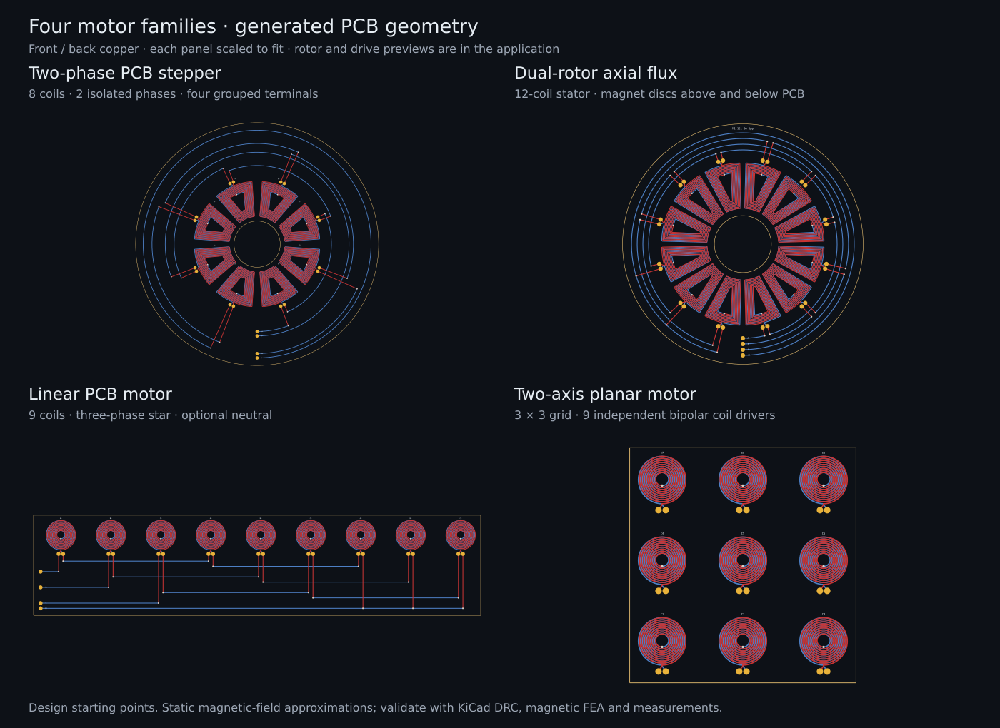

# Planar Studio

Design planar inductors, transformers, PCB motors, filters and antennas inside
KiCad. Planar Studio reads your board's stack, calculates electrical estimates,
and places the generated copper into the PCB as one undoable operation.

**[Download v1.6.0](https://github.com/jonahsaunders/planar-studio/releases/download/v1.6.0/planar-studio-1.6.0.zip)**
· [Install](#install) · [Guides](#guides) · [Flyback example](#5-w-planar-flyback-example)

## What you can build

| Workspace | Design capabilities | Guide |
| --- | --- | --- |
| **Inductor** | Spiral and contour windings, series or parallel layers, and routing around board obstacles | [Windings and obstacles](docs/winding-obstacles.md) |
| **Transformer** | Air-core and ferrite windings, multiple outputs, interleaving, candidate comparisons and verification studies | [Transformer design](docs/transformer-design.md) |
| **PCB motor** | Rotary, stepper, linear, dual-rotor and two-axis planar layouts, with phase assignments and terminal routing | [Motor families](docs/motor-families.md) |
| **Filter** | Lumped LC, stepped-impedance, coupled-line, hairpin, interdigital and EMI networks | [Filter models](docs/engineering-models.md#filter-families) |
| **Antenna** | Patches, dipoles, inverted-F radiators, NFC loops, arrays and directional layouts | [Antenna families](docs/creator-families.md) |

Save editable designs, compare calculated responses, and export KiCad boards or
footprints, SVG, DXF, JSON and specification sheets. The **Design tools** panel
adds constrained searches, measurement overlays, tolerance studies and board
checks; see the [tools guide](docs/design-tools.md).

Motor geometry previews

<!-- motor-gallery:start -->
Generated from the PCB exporter; these are geometry previews, not application
screenshots.

<!-- motor-gallery:end -->

See [coil shapes and terminal options](docs/motor-coils.md) for wiring details.

## Install

The **1.6.0 development release** supports KiCad **9.0.1 or newer** on Windows,
macOS and Linux. [Release notes](https://github.com/jonahsaunders/planar-studio/releases/tag/v1.6.0).

1. Download [planar-studio-1.6.0.zip](https://github.com/jonahsaunders/planar-studio/releases/download/v1.6.0/planar-studio-1.6.0.zip) and leave it zipped.
2. In KiCad's main Project Manager, open **Plugin and Content Manager**.
3. Choose **Install from File**, select the ZIP and apply pending changes.
4. Restart KiCad, open the PCB Editor, and launch **Planar Studio** after its
   Python environment finishes setting up.

Upgrading or getting a metadata error?

To upgrade, close Planar Studio and the PCB Editor. In **Plugin and Content
Manager → Installed**, uninstall the old version and apply pending changes
before installing the new ZIP. Saved designs are stored separately; preserve
the settings folder.

Use the installer linked above. GitHub's **Code → Download ZIP** and **Source
code** archives contain the repository, not a PCM installer.

## 5 W planar flyback example

An **18–36 V DC to isolated 5 V / 1 A** converter with an LT8302 controller and
transformer windings built into a six-layer PCB. The example includes a KiCad 10
project, schematic, BOM, assembly panel, calculations and manufacturing files.

**Unbuilt engineering prototype.** Factory acceptance and electrical, thermal
and magnetic qualification remain open.

[Explore the board and schematic](examples/planar-flyback-5w/README.md)
· [Review package](examples/PS-FLYBACK-5W-A1-review-package.zip)
· [Validation record](examples/planar-flyback-5w/VALIDATION.md)

## Guides

- [Design tools](docs/design-tools.md) — optimization, measurements, tolerances and board checks.
- [Layer setup and loaded transformers](docs/stack-load-antennas.md) — board layers, winding stacks and source/load models.
- [Directional antennas](docs/directional-antennas.md) — Vivaldi, Yagi, log-periodic and bow-tie layouts.
- [Engineering models](docs/engineering-models.md) — equations, reference comparisons, assumptions and limits.
- [Development](docs/development.md) — run without KiCad, build an installer, run checks and capture screenshots.

Calculated performance depends on the selected model. Review its assumptions
and validate the resulting hardware with appropriate simulation, KiCad DRC and
measurements. Transformer loss or thermal results that cannot be calculated are
reported as unknown.

Built on [planar-coil-studio](https://github.com/jonahsaunders/planar-coil-studio).
Released under the [MIT license](LICENSE).
