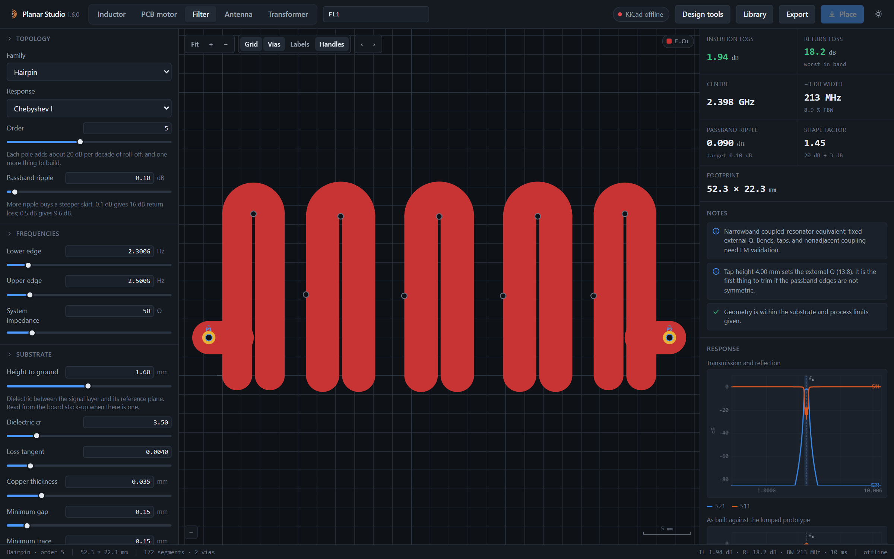
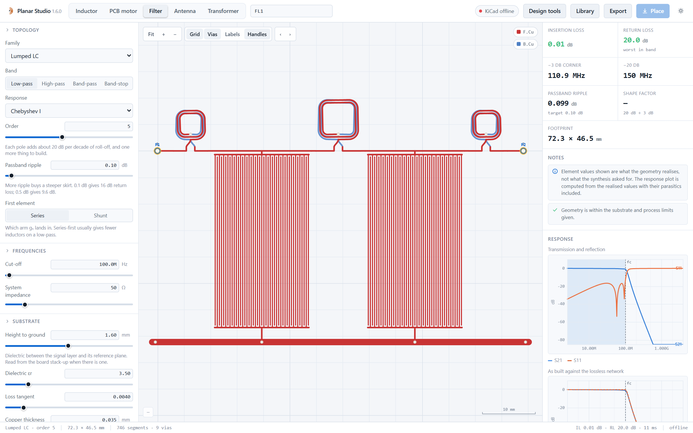

# Engineering models

[Back to Planar Studio](../README.md)

Planar Studio combines numerical winding calculations with analytical models for
motors, transmission lines and filters. These estimates support design and
comparison; physical performance depends on the model assumptions and must be
verified for the intended application.

For ferrite assemblies, loaded windings, loss estimates and calibration, see the
[transformer design guide](transformer-design.md). Antenna assumptions are
documented in the [family guide](creator-families.md) and
[directional antenna guide](directional-antennas.md).

## Inductance solver

Inductance is a partial-inductance sum over the discretised 3-D filament path —
the Neumann double integral with a geometric-mean-distance kernel, self terms
from Grover's straight-bar expression, plus a discretisation correction that is
recalibrated for the segment length and cross-section on every solve.

Because the whole multi-layer path (including via barrels) is one filament
chain, inter-layer mutual inductance falls out of the same sum rather than
being bolted on as a coupling coefficient.

The [numerical checks](../tests/verify.mjs) compare the solver with
reference cases. The documented comparisons are:

| Case | Reference | Result |
|---|---|---|
| Single circular loop | `µ₀R(ln(8R/GMD) − 2)` | **0.04 %** |
| Two coaxial loops, 1 mm apart | Maxwell's elliptic-integral mutual | **0.29 %** |
| Square planar spirals | Mohan current-sheet expression | **3.1 – 7.3 %** |
| Circular planar spirals | Mohan current-sheet expression | **1.4 – 2.3 %** |
| 50 Ω on 1.6 mm FR-4 | Published width | **1.3 %** |
| Coupled Z0e/Z0o, w 1.5 s 0.3 | Published tables | **0.4 / 3.0 %** |
| Chebyshev g-values | Matthaei tables | **< 0.01 %** |
| Interdigital insertion loss | `4.343·Σg/(FBW·Q_u)` | **1.1 – 4.5 %** |

The Mohan expression carries roughly ±3–8 % of its own error, so those two rows
are agreement, not deviation. The tool shows the numerical and closed-form
values side by side wherever a closed form exists.

## Model reference

| Quantity | Model |
|---|---|
| Inductance | Partial inductance, Neumann + GMD kernel; Grover self terms |
| Closed-form cross-check | Mohan current-sheet and modified Wheeler, where the shape has coefficients |
| AC resistance | Dowell, with porosity correction `η = w/(w+s)` |
| Interlayer capacitance | Plate capacitance with the 1/3 energy factor for a series stack |
| Turn-to-turn capacitance | Coplanar strips on substrate, scaled by `(n−1)/n²` |
| Current rating | IPC-2221, `I = k·ΔT^0.44·A^0.725`, `k` = 0.048 external / 0.024 internal |
| Motor | Sinusoidal PMSM: `Kt = 1.5·p·λ`, `λ = N·kw·Φ`, `Φ = (2/π)·B·A_pole` |
| Microstrip | Hammerstad–Jensen with thickness correction; Getsinger dispersion |
| Coupled microstrip | Modal capacitance decomposition (Garg & Bahl) |
| Filter prototypes | Matthaei/Pozar g-values; standard LP/HP/BP/BS transforms |
| Filter response | ABCD cascade → S-parameters, with realised parasitics |
| Interdigital capacitor | Coplanar-strip conformal mapping, `(N−1)` gaps in parallel |

Airgap flux density is an input, not a magnetostatic solve — feed it from your
magnet grade and gap. IPC-2221 assumes still air and an isolated conductor; a
coil packed against its neighbours runs hotter than the single-trace figure, and
a stator has no still air around it at all.

## Geometry and circuit conventions

- **Series layers:** alternate spiral layers are mirrored about the X axis so
  their fields add. Reversing traversal alone would reverse circulation. The
  generators share transition points on the +X ray.
- **Inverse coil sizing:** fractional turns change terminal and via placement,
  which can make inductance nonmonotonic. The solver searches whole turns, then
  adjusts diameter.
- **Resonator loss:** unloaded Q is represented as a parallel conductance.
  Distributed-filter loss includes the substrate's dielectric limit.
- **Bandwidth:** crossings must bracket the intended passband. Higher-order
  passbands and multiple equal-ripple peaks are not interchangeable with the
  desired band edges.

## Filter families

Six families, synthesised from a prototype and laid out as copper:

| Family | What it is | Where it belongs |
|---|---|---|
| Lumped LC | Spiral inductors and planar capacitors in a ladder | DC to a few hundred MHz |
| Stepped impedance | Alternating wide and narrow line sections | Microstrip low-pass |
| Edge-coupled | Parallel half-wave resonators | The default microstrip band-pass |
| Hairpin | Coupled resonators folded into a U | Folded band-pass layouts |
| Interdigital | Quarter-wave resonators grounded at alternating ends | Compact band-pass layouts |
| EMI / power | Pi, T and common-mode networks | Conducted-noise filtering |

Butterworth, Chebyshev and Bessel prototypes; low-pass, high-pass, band-pass
and band-stop transforms; S-parameters, VSWR and group delay from an ABCD
cascade.

## Filter synthesis and response

The filter workspace synthesizes a network, generates copper, then calculates
a response from that geometry. The geometry calculation includes estimated
inductance, Q and capacitor parasitics. It is plotted alongside the ideal
prototype so the effects of realizing the network in copper are visible.
Both curves are model predictions, not hardware measurements.

Initial layouts use textbook synthesis, so the geometry's calculated center
frequency and bandwidth can differ from the requested values. The Design Tools
panel can tune geometry against a response mask. Validate a final RF design with
an appropriate electromagnetic model and measurements.

## References

- Mohan, Hershenson, Boyd & Lee. *Simple accurate expressions for planar spiral
  inductances.* IEEE J. Solid-State Circuits 34(10), 1999.
- Greenhouse. *Design of planar rectangular microelectronic inductors.* IEEE
  Trans. Parts, Hybrids and Packaging 10(2), 1974.
- Grover. *Inductance Calculations: Working Formulas and Tables.* Dover, 1946.
- Dowell. *Effects of eddy currents in transformer windings.* Proc. IEE 113(8),
  1966.
- IPC-2221B, *Generic Standard on Printed Board Design*, §6.2.
- Hammerstad & Jensen. *Accurate models for microstrip computer-aided design.*
  IEEE MTT-S, 1980.
- Getsinger. *Microstrip dispersion model.* IEEE Trans. MTT-21, 1973.
- Gupta, Garg, Bahl & Bhartia. *Microstrip Lines and Slotlines*, 2nd ed.
- Bahl. *Lumped Elements for RF and Microwave Circuits*, 2003.
- Matthaei, Young & Jones. *Microwave Filters, Impedance-Matching Networks and
  Coupling Structures*, 1980.
- Pozar. *Microwave Engineering*, 4th ed., ch. 8.
- Hong. *Microstrip Filters for RF/Microwave Applications*, 2nd ed., 2011.
- Gielis. *A generic geometric transformation that unifies a wide range of
  natural and abstract shapes.* American Journal of Botany 90(3), 2003.
