# Feature gallery

[Back to Planar Studio](../README.md)

Fifteen views captured from the current application on September 30, 2026.
Each image opens at full resolution. The app runs in browser mode with isolated
demo settings; KiCad is offline and readouts are calculated estimates.

[Inductors](#inductors) · [Transformers](#transformers) · [PCB motors](#pcb-motors)
· [Filters](#filters) · [Antennas](#antennas) · [Design tools](#design-tools)

## Inductors

### Layers, geometry and frequency response

Two parallel copper layers, adjustable spiral geometry, and calculated
inductance, resistance, Q and self-resonance.

[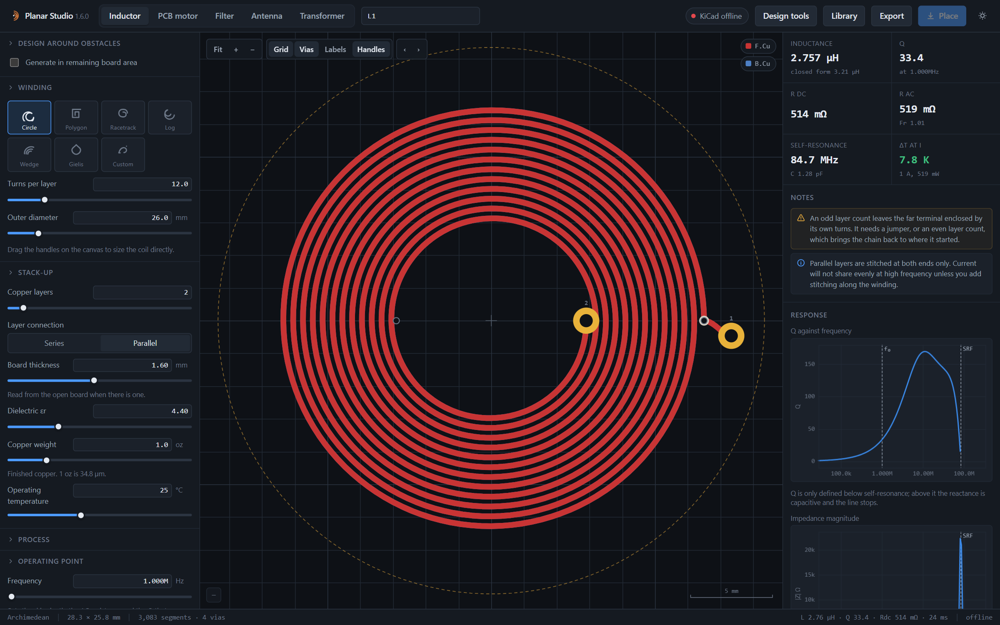](screenshot-inductor.png)

### Route around board obstacles

An editable board region with a connector keepout and mounting hole. The
generated contour winding follows the remaining space.

[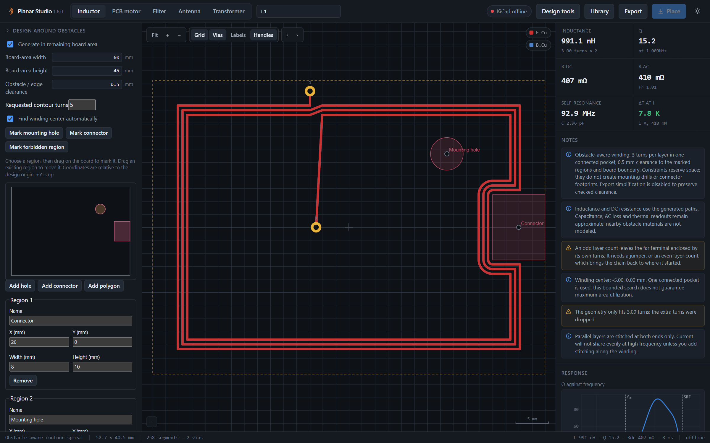](screenshot-obstacles.png)

[Winding and obstacle guide](winding-obstacles.md)

## Transformers

### Copper, winding stack and core assembly

A four-layer ferrite design with primary/secondary connections, physical layer
heights and a catalog-core cross-section.

[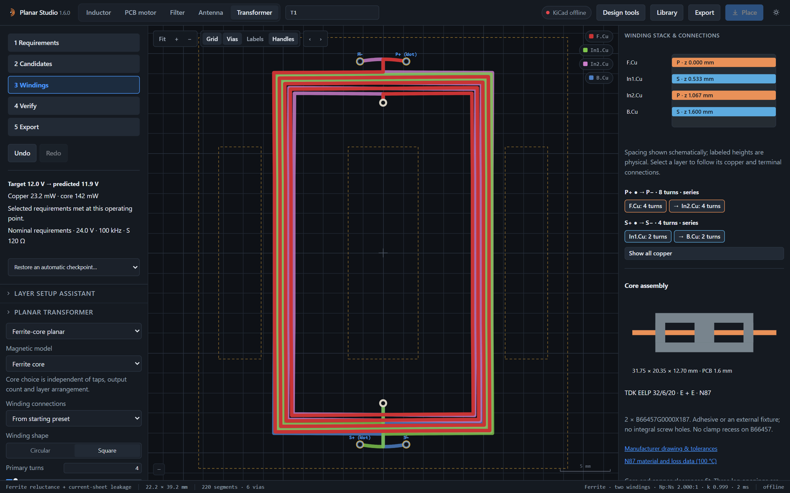](screenshot-transformer.png)

### Search the size and loss tradeoff

The Candidates stage compares feasible starting designs against the chosen
requirements. Unknown thermal results remain separate from calculated limits.

[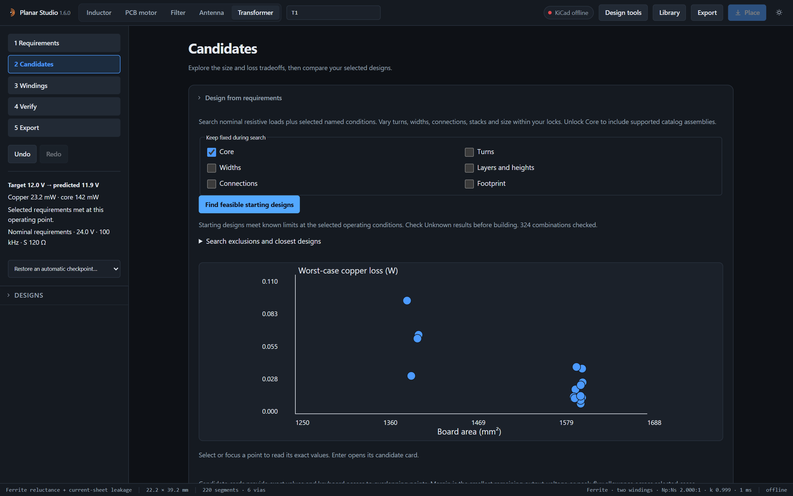](screenshot-transformer-search.png)

[Transformer design guide](transformer-design.md)

## PCB motors

### Three-phase rotary

Twelve stator coils, phase routing and signed winding phasors alongside motor
estimates.

[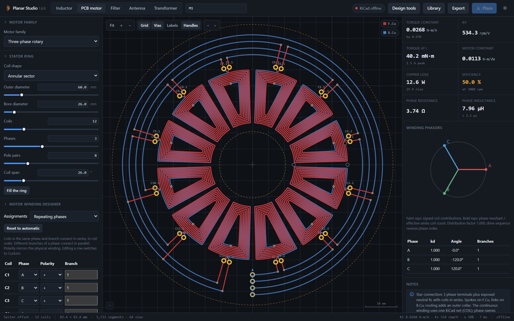](screenshot-motor.png)

### Two-phase stepper

Independent A/B phases with microstep controls and an equilibrium preview.

[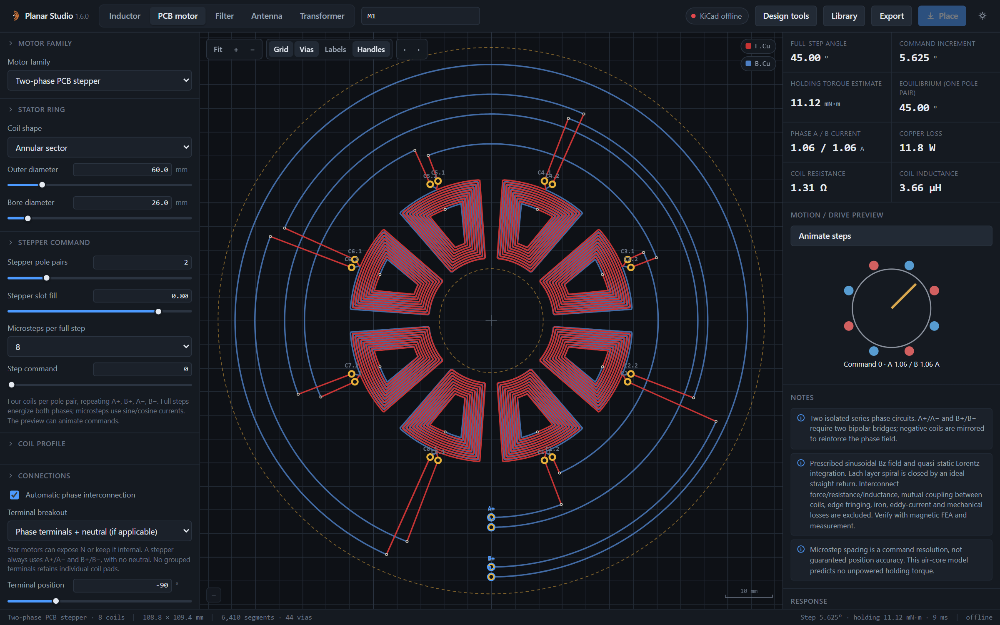](screenshot-motor-stepper.png)

### Linear motor

A three-phase coil array with position, current and thrust estimates.

[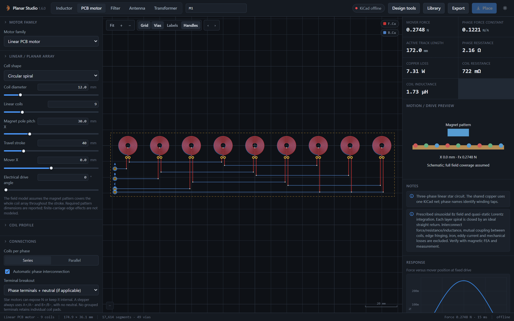](screenshot-motor-linear.png)

### Dual-rotor axial flux

A stator between two magnet discs, with independent gap and alignment inputs.

[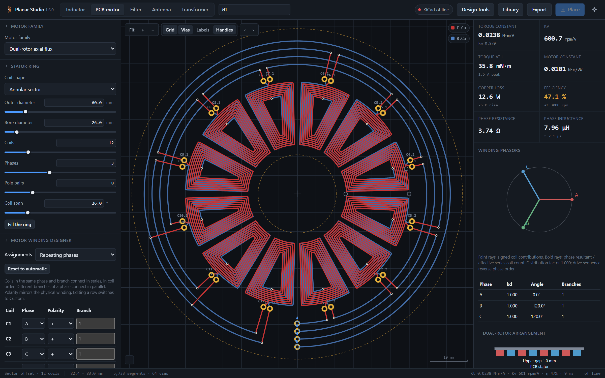](screenshot-motor-dual-rotor.png)

### Two-axis planar motor

An independently driven coil grid with X/Y force and driver-current readouts.

[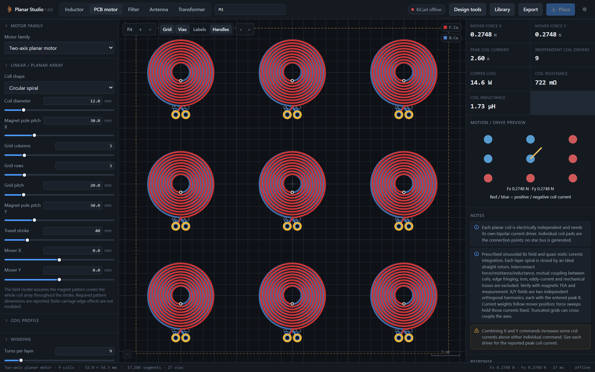](screenshot-motor-planar.png)

[Motor family guide](motor-families.md) · [Coil shapes and terminals](motor-coils.md)

## Filters

### Microstrip hairpin

A five-pole hairpin layout using a low-loss substrate model, with calculated
transmission and reflection plotted beside the geometry.

### Lumped LC, light theme

Spiral inductors and interdigital capacitors with ideal and geometry-based
response estimates.

[Filter models and assumptions](engineering-models.md#filter-families)

## Antennas

### Patch array

Four individually fed patch elements, substrate controls and ideal array-factor
cuts. The plot does not predict the realized radiation pattern.

[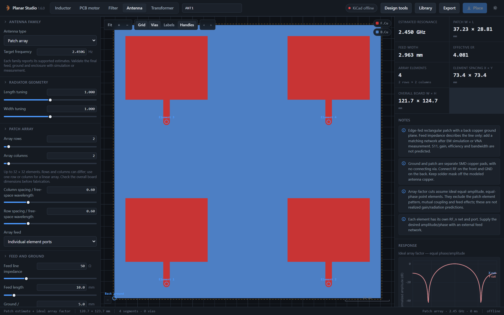](screenshot-antenna.png)

### Vivaldi tapered slot

A continuous copper taper with feed and mechanical dimensions.

[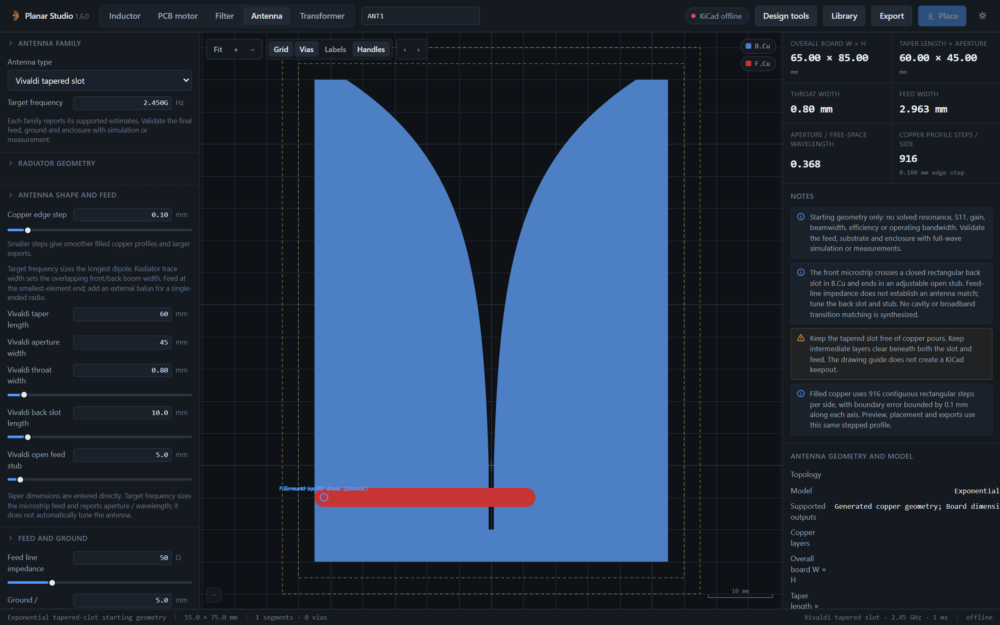](screenshot-antenna-vivaldi.png)

### NFC loop

Loop geometry, target-inductance sizing and tuning estimates at 13.56 MHz.

[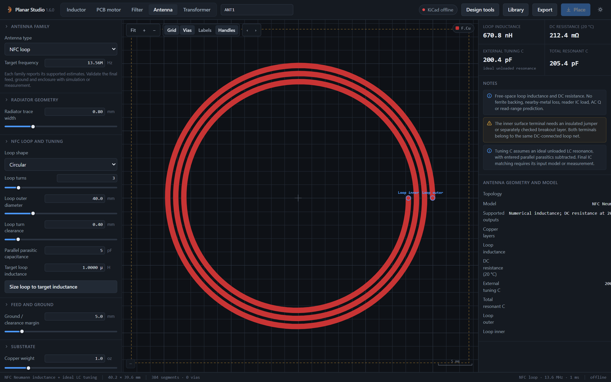](screenshot-antenna-nfc.png)

[Antenna families](creator-families.md) · [Directional antennas](directional-antennas.md)

## Design tools

### Inspect the magnetic field

A calculated free-space field slice above the inductor. The same panel provides
optimization, measurement overlays, coupled-coil studies, tolerances, filter
tuning, board checks and rotor tools.

[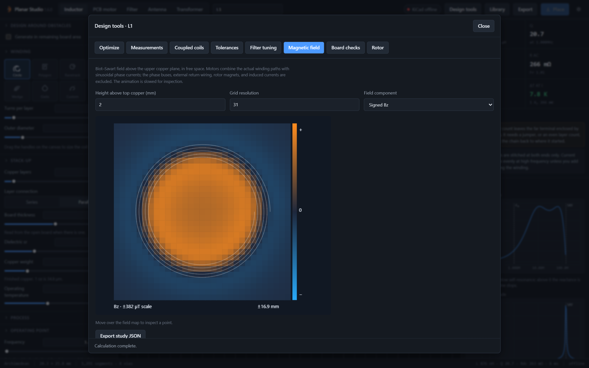](screenshot-tools.png)

[Design tools guide](design-tools.md)

---

The README cover is a styled vector illustration generated by the current
geometry engines. The fifteen views above are unmodified application captures.
See [capture provenance](feature-capture.json) and
[reproduction commands](development.md#screenshots).
