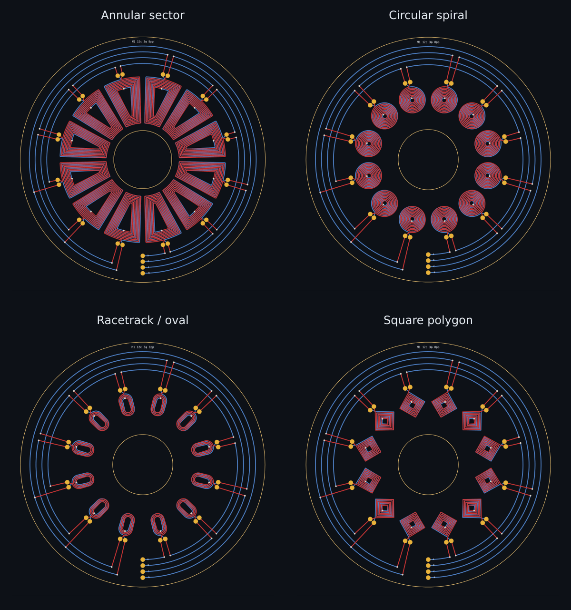

# Motor coils and star wiring

The PCB motor workspace now offers annular-sector, circular, racetrack/oval,
and polygon coils. Polygon sides include square, hexagonal, octagonal and
higher-sided profiles. Outer diameter and bore still describe the stator ring;
conventional coils are fitted into each slot before being rotated around it.
The oval aspect ratio adjusts its proportions. Max turns uses the selected
shape's capacity, including space for the inner via on conventional coils.
Requested turns that do not fit are reported beside the results.

## Grouping the connections at the bottom

1. Select **PCB motor** and a **Coil shape**.
2. Use **two copper layers** with **Layer connection: Series**.
3. Enable **Connect phases in star (wye)**.
4. Choose **Series** or **Parallel** under **Coils per phase**.
5. Choose a **Terminal breakout** (see below).
6. Leave **Terminal position** at **−90°** for the bottom, or rotate it.

A, B and C are separate drive terminals, grouped along a radial line at the
chosen angle. N is the shared neutral terminal. The three drive terminals are
connected to N through their windings; they are not directly shorted together.
The same scheme supports one to six phases, provided the coil count divides
evenly into the phase count. Each individual coil retains numbered terminals
C1.1/C1.2, C2.1/C2.2, and so on.

### Terminal breakout choices

| Choice | Grouped pads for three phases | Internal wiring |
| --- | --- | --- |
| Phase terminals + neutral | A, B, C, N | Star point also exposed as N |
| Phase terminals only | A, B, C | Star point remains connected internally |
| No grouped terminals | None | Star and same-phase links remain; use individual coil pads |

The default preserves the previous A/B/C/N layout, including older designs
without this setting. No grouped terminals removes the extra pads and breakout
tails, rather than merely hiding labels. Turn **Connect phases in star (wye)**
off as well when you want completely independent coils for your own routing.
Individual coil pads remain available in every mode.
With star routing enabled and no grouped terminals, use C1.1 for phase A,
C2.1 for B and C3.1 for C. In parallel mode the other start pads of the same
phase are equivalent; in series mode use the first coil's start, not an
intermediate series junction.

Four pads do not mean four phases: N is the common end of the three windings.
A conventional three-wire star motor keeps that junction internal and exposes
only its three phase leads. A delta-connected motor also has three phase leads,
but its windings form a closed triangle with no neutral junction. Lead count
alone does not distinguish star from delta. This option changes which taps are
exposed; it does not convert the winding to delta. See [TI's winding connection
diagrams](https://www.ti.com/content/dam/videos/external-videos/en-us/4/3816841626001/6067548423001.mp4/subassets/precision_labs_motor_types.pdf)
and [Microchip's neutral-point explanation](https://onlinedocs.microchip.com/oxy/GUID-78E22D6C-5DFB-43DC-9878-13A171504D6B-en-US-2/GUID-013AE6B0-B028-44BF-9D66-98EE8BF68AE2.html).

The default is now 12 coils, eight pole pairs and two series copper layers.
Eight pole pairs align the repeated same-phase coils for this simple winding
schedule. Existing designs retain their saved parameters; missing shape and
terminal-position settings use the sector and bottom defaults when loaded.

## How the routing works

Radial spokes run on the first selected copper layer. Circumferential links
run on the last, with through vias only at each spoke's destination. This lets
spokes pass over other phases' links without joining them.

In series mode, each phase starts at its drive terminal, passes through every
coil in that phase once, then ends at N. The arcs have deliberate breaks beside
each coil, preventing a bus from bypassing the winding. In parallel mode every
coil start joins its phase input and every end joins N. The neutral arc connects
the returns together, and to the N pad only when neutral breakout is enabled.

Routing occupies an **outer collar**. The generated board outline expands to
contain the collar and terminal pads, while the bore stays empty. The control's
outer diameter describes the winding ring, not the finished board diameter.
Increasing pad sizes also increases the collar lane spacing.

The old bore buses were removed: their neutral ring was disconnected, their
radial tracks crossed other rings, and their geometry did not implement the
series/parallel selection. Reopening an older motor design recalculates its
artwork with the corrected routing rules.

## KiCad and export behavior

A continuous copper winding is one electrical net in KiCad. Routed star designs
therefore use the selected net name for all connected copper. A/B/C/N are named
winding taps and labels, not electrically isolated copper nets. Model the
winding as a component in the schematic; do not assign different copper nets
directly to joined traces. Create the chosen net in KiCad before placement if
net assignment is needed.

KiCad board/footprint, SVG, DXF, JSON and specification exports share the same
artwork. Shapes, aspect ratio, polygon sides, connection choice and terminal
angle are saved with the design. The magnetic-field tool rotates its coils to
match the artwork.

## Supported geometry and model limits

- Automatic routing supports exactly two series winding layers and whole turns,
  with both coil terminals accessible outside the winding. It does not silently
  change saved layer counts or the open board's settings. Other setups show an
  error and export individual coil terminals without star tracks. Disable star
  routing when making a design intended for manual interconnection.
- Coil overlap, insufficient terminal spacing, unbalanced phase counts and
  impossible dimensions are reported. The layout checks are not a replacement
  for KiCad DRC or inspection of the fabricated board.
- The existing multilayer coil engine/export path does not provide an isolated
  blind/buried-via topology for automatically connecting more than two series
  layers. This change does not claim to solve that limitation.
- Coils use a repeated phase sequence with equal winding polarity. This is not
  an automatic slot/pole winding-schedule optimizer. The workspace warns when
  the same-phase coil phasors do not align with the selected rotor pole count.
- Numerical coil inductance and DC resistance use the chosen geometry. Motor
  torque/back-EMF still use the original annular-sector flux and pitch-only
  model: they omit distribution cancellation and are not a reliable ranking of
  circular versus sector performance. Use field simulation and measurements.
- Interconnect resistance, interconnect inductance, inter-coil mutual coupling,
  iron loss, windage and inverter losses are not included in the motor estimates.

## References reviewed

- [atomic14: Scripting KiCad to make coils](https://www.atomic14.com/2022/10/23/scripting-keycad-to-make-coils): creator's illustrated circular/sector coil and star-wiring walkthrough.
- [atomic14: Create Powerful PCB Coils with Automation](https://www.youtube.com/watch?v=CDhlx_VMpCc): reviewed via the [creator's timestamped transcript](https://www.atomic14.com/videos/posts/CDhlx_VMpCc), particularly 2:01–3:45 for mirrored layers/star wiring and 4:14–6:58 for arbitrary shapes. Direct YouTube playback was unavailable.
- [atomic14: Wedge or Spiral Coils — Which is best?](https://www.atomic14.com/2022/11/20/simulation-coils): visual comparison and discussion of conductor geometry.
- [PCB motors for sub-fractional HP auxiliary fan drives: a feasibility study](https://link.springer.com/article/10.1007/s00502-022-01006-3): Figure 3 shows grouped A/B/C/N terminals at the bottom of a stator.

## Validation

`node tests/motor-layout.mjs` checks physical interconnect components with the
windings removed, so a series-coil bypass or an unconnected neutral cannot hide
behind the winding's own continuity. Scenarios cover all shapes, series and
parallel connections, terminal rotation, coil counts, containment inside the
board outline, local-coordinate inductance invariance, export generation,
configuration round trips and rejection of unsupported configurations.

`node tests/motor-dom.mjs` exercises real controls, visibility, recomputation,
save/load and error messages with a DOM harness. Canvas drawing is stubbed in
this test; it does not replace a browser or live KiCad test.
