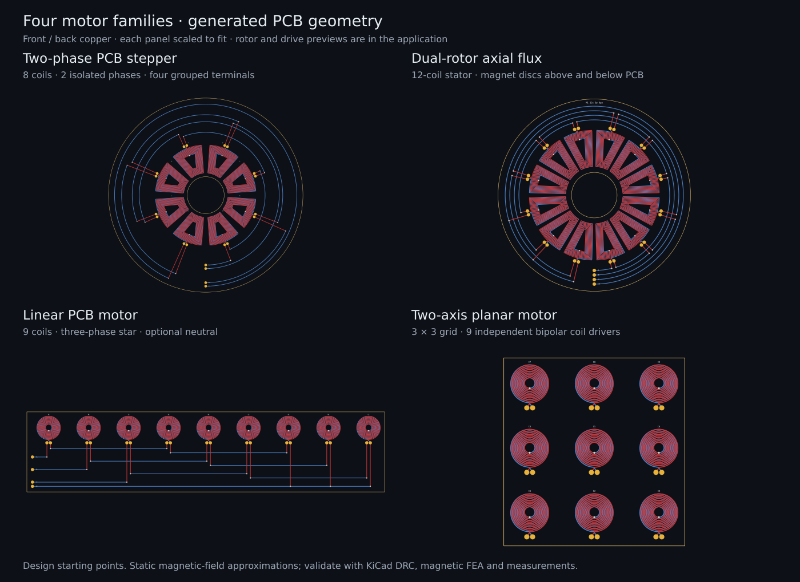

# Motor families

The **PCB motor → Motor family** selector adds four choices alongside the
existing three-phase rotary motor. Saved older motors open in the original
rotary family. Switching families preserves entered settings; fields appear
only where they apply. Each family has geometry, readouts, response plots and
a drive or rotor preview. These are design and static-model tools, not a
validated motor simulator or a controller firmware generator.

| Family | Layout and controls | Connections | Readouts |
| --- | --- | --- | --- |
| Two-phase PCB stepper | Ring with four coils per rotor pole pair; coil shape, slot fill, full/microstep command and animation | Two isolated series phases, A+/A− and B+/B− | Step increment, estimated energized holding torque, equilibrium, phase currents and static torque-angle curve |
| Linear PCB motor | Straight three-phase coil array; coil profile, pole pitch, travel, position and electrical drive angle | Series/parallel star; A/B/C/N, A/B/C or no grouped terminals | Mover force, force constant, phase currents/resistance and fixed-drive force-position curve |
| Dual-rotor axial flux | Rotary stator between two magnet discs; separate air gaps, magnet dimensions/remanence and relative alignment | Same options as the rotary stator | Combined field estimate, stack dimensions, alignment curve and rotary motor estimates |
| Two-axis planar motor | Rectangular independent-coil grid; row/column count, grid spacing, X/Y magnet pitches, position and current commands | Two pads per cell; separate bipolar current driver for every coil | Fx/Fy, coil current distribution, peak current, winding loss and fixed-current position sweeps |

## Stepper

The layout repeats A+, B+, A−, B− around the ring. Negative-polarity coils are
physically mirrored. Automatic routing makes two isolated series circuits;
each connection uses its own lane outside the winding ring to avoid bypassing
coils when mirrored terminals change angular order. There is no neutral.
The collar grows with coil count, so winding diameter is smaller than the
finished board diameter.

Choose 1–6 **Stepper pole pairs**. The rotor has `2p` alternating magnetic poles
and the stator has `4p` coils. This simple air-core design has a full-step
increment of `90/p` mechanical degrees. It does not reproduce a toothed hybrid
stepper's typical 1.8° full step. **Microsteps per full step** accepts 1, 2, 4,
8, 16 or 32. Full steps energize both phases at the entered current; microsteps
use sine/cosine currents with that peak, so their loss and torque amplitude
differ from the two-phase-on full-step mode. Command resolution is not a
guarantee of positioning accuracy.

**Animate steps** advances the electrical command. The pointer shows the
predicted static equilibrium within one rotor pole-pair period, not simulated
rotor dynamics. Switching workspace/family stops stepping. The model has no
unpowered detent/holding torque and does not predict pull-out speed, inertia,
acceleration, resonance or missed steps.

With **No grouped terminals**, connect A+ to C1.1 and A− to the last A coil's
second pad; B+ to C2.1 and B− to the last B coil's second pad. Exact pad names
are reported in the notes. Turning automatic interconnection off removes all
phase links and leaves the individual coil pads.

## Linear

Choose a multiple of three coils, from 3 to 36. Coil-center spacing is
`2 × pole pitch / 3`, giving 120 electrical degrees between adjacent coils.
Pole pitch means distance between neighboring opposite magnetic poles; one
full magnetic period is twice that distance. Circular, oval and polygon cells
are supported. Too-small pitch or oversized pads produce a layout error.

The magnet-pattern reaction force is evaluated at **Mover X**. At the default
center position, a drive angle of 0° gives positive thrust, 90° gives zero and
180° reverses it. Matching drive angle to `180° × X / pole pitch` maintains
positive thrust in this ideal field model. The response plot holds drive
currents fixed while sweeping position. It is not a velocity or acceleration
plot. Entered current is the peak phase current; parallel-connected coils
share it equally in the model.

Star links run on separate lanes below the array, with grouped pads along the
left edge of that routing strip. Three-terminal mode keeps the star point
internal. No-grouped-terminal mode preserves the internal circuit and exposes
its phase inputs at C1.1, C2.1 and C3.1. Automatic interconnection can also be
disabled for custom wiring. See [the coil/wiring guide](motor-coils.md) for the
distinction between three phase leads and an exposed fourth neutral lead.

The magnetic pattern must cover the entire array over the full requested
stroke. The minimum coverage length is reported. A short moving magnet block
would have edge effects that this model does not calculate; the preview block
is a schematic marker, not a mechanical design.

## Dual rotor

The existing rotary PCB winding is placed between two magnet discs. Gap
values are measured from each PCB surface to the corresponding magnet face.
The field at the copper midplane is estimated from one isolated cylindrical
magnet on each side:

`B(g) = Br/2 × [(z+t)/sqrt((z+t)²+r²) − z/sqrt(z²+r²)]`,
where `z = g + PCB thickness/2`, `t` is magnet thickness and `r` magnet radius.

The two amplitudes are combined as spatial harmonics:
`Bcombined = |Bupper + Blower exp(j p δ)|`. Zero relative offset means
reinforcing axial fields. With equal gaps, a half electrical revolution
(`180/p` mechanical degrees) cancels them in this model. Gap and alignment
changes feed the existing torque/back-EMF estimates.

This construction uses cylinder centerline amplitudes as harmonic amplitudes;
it does not extract the fundamental from a real magnet array. It excludes
neighboring magnets, back iron, leakage, field variation through the PCB and
rotor attraction. The side view is schematic, and the reported total stack
excludes rotor back plates. PCB exports contain the stator; rotor discs,
bearings, fixtures and other mechanical parts are not generated as CAD solids.

## Two-axis planar

Choose a 2–8 by 2–8 grid. Every cell has its own copper net and two terminal
pads. A 3×3 grid therefore needs nine independently controlled bipolar coil
drivers, not two or three shared phase outputs. The X and Y current commands
produce a position-dependent signed current in every coil. Combined commands
can exceed either individual command in a coil; use the reported peak current
when sizing drivers. Cell pads remain available and there is no shared bus.

The magnetic field is the sum of two independent sinusoidal normal-field
harmonics, one varying in X and one in Y. The entered field is the peak of
**each** harmonic, so their sum can be larger. The field is assumed to cover
the complete grid throughout travel; minimum X/Y coverage is reported.
Truncated grids and arbitrary pole pitches can cross-couple the axes. The
model predicts in-plane force only: it does not design a Halbach magnet array,
compute levitation, stabilize height or predict yaw/pitch/roll.

## Geometry, models and exports

The new stepper, linear and planar families require **two copper layers** with
**Layer connection: Series**, including manual-interconnection layouts.
Unsupported layer setups produce an error instead of exporting an ambiguous
multilayer winding. Coil turns must be whole numbers; turns that cannot fit
are capped and reported. **Max turns** uses the selected family's geometry.
Automatic routing uses front-layer escapes and back-layer links, with through
vias only at each escape's destination lane. Run KiCad DRC after placement.

The stepper/linear/planar force model integrates `I dl × B` and its torque
moment over the actual winding-layer paths. Each layer spiral is closed with
an ideal straight return for this integral. This is a closed-loop winding
approximation; it omits the physical leads/interconnect forces. It uses a
prescribed sinusoidal Bz field, not a field solved from magnet dimensions.
Coil resistance and inductance use the existing numerical winding engine.
Reported copper loss excludes routing resistance; phase inductance omits
mutual coupling between different coils. Eddy-current, mechanical and iron
losses and motion dynamics are excluded. Magnetic FEA and measurements are
needed to assess real performance.

KiCad board/footprint, SVG and DXF exports use the selected family's copper
and board outline. JSON and saved designs preserve family settings and the
terminal-breakout choice; specifications use family-specific outputs. Each
connected winding circuit uses one KiCad net. Stepper phases use separate
`<net>_A` and `<net>_B` nets; planar cells use `<net>_C1`, `<net>_C2`, etc.
Create the required nets before direct placement. The old field-slice and
single-rotor tools are disabled where their rotary assumptions do not apply.

## Validation and references

`node tests/motor-families.mjs` checks 54 layout combinations and independent
physics invariants: isolated routing without coil bypass, export finiteness,
board containment, configuration round trips, uniform-field cancellation,
gradient force sign, phase quadrature, current/field scaling, movement phase,
X/Y force response, dual-field reinforcement/cancellation and invalid inputs.
`node tests/motor-dom.mjs` exercises all family controls, previews, step
animation, save/load, exports and invalid-layout recovery. The DOM harness
stubs canvas; rendered-browser, live KiCad and physical motor validation remain
outstanding.

Primary references informing the family choices and model boundary:

- [MIT: Magnetic field and force, chapter 8](https://ocw.mit.edu/courses/8-02t-electricity-and-magnetism-spring-2005/90510e513af27a2dde30b890a61bbcd1_ch8magneti_field.pdf).
- [Design and Performance Enhancement of a PCB Axial-Flux Stepper Motor](https://www.mdpi.com/2079-9292/15/4/777).
- [Optimal coil design for coreless linear motors](https://research.tue.nl/en/publications/optimal-coil-design-for-coreless-linear-motors-based-on-the-exten/).
- [Double-rotor axial-flux winding topology study](https://ietresearch.onlinelibrary.wiley.com/doi/full/10.1049/iet-epa.2020.0622).
- [Force and torque model with a 2D Halbach array and PCB coils](https://pmc.ncbi.nlm.nih.gov/articles/PMC10648773/).

These references motivate the architectures. The approximations implemented
here do not reproduce or validate the complete machines in those papers.
