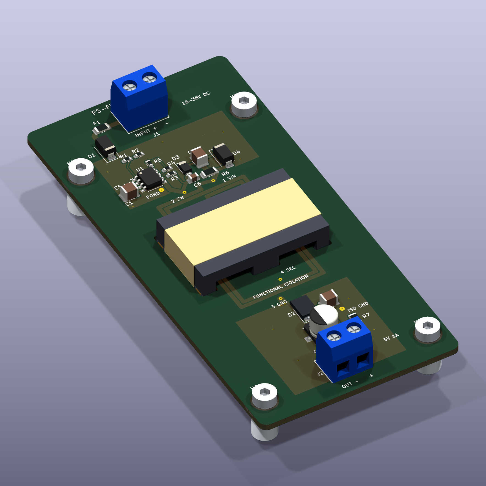

# Complete 3D assembly — PS-FLYBACK-5W A1

All **26 footprints** have visible, bundled STEP models: 21 electronic parts,
the T1 prepared core assembly and four illustrative M3 mounting assemblies.
The 14 distinct assets use `${KIPRJMOD}/3dmodels/` paths, so the extracted
project needs no installed KiCad model library or internet connection.

[](evidence/audit/board-3d-assembled.png)

[Underside](evidence/audit/board-3d-underside.png) ·
[Top](evidence/audit/board-3d-top.png) · [Bottom](evidence/audit/board-3d-bottom.png) ·
[Side](evidence/audit/board-3d-side.png) ·
[Assembly STEP](3d/PS-FLYBACK-5W.step) · [Assembly GLB](3d/PS-FLYBACK-5W.glb)

For an interactive view, open `kicad/PS-FLYBACK-5W.kicad_pro`, open the board,
then choose **View → 3D Viewer**. Rotate and zoom the assembly there. The STEP
and GLB exports also open in compatible CAD/3D viewers; GitHub offers them as
downloads. These exports contain the board body and components; KiCad's PNG
views additionally show copper, mask and silkscreen.

## Model coverage and provenance

| References | Model basis | Scope |
| --- | --- | --- |
| U1 | KiCad SOIC-8 exposed-pad package; [LT8302 S8E drawing, page 24](https://www.analog.com/media/en/technical-documentation/data-sheets/lt8302-8302-3.pdf) | Generic 3.9 × 4.9 mm body, 1.27 mm pitch. Nominal model pad 2.29 × 3.00 mm versus land 2.26 × 2.99 mm; not vendor-certified CAD. |
| C3 | KiCad 6.3 × 5.9 mm electrolytic; [Panasonic 16SVPF180M](https://industrial.panasonic.com/ww/products/pt/os-con/models/16SVPF180M) | Generic case with polarity indication; no exact vendor sleeve artwork. |
| J1, J2 | Original model from [KEFA KF301-5.0 drawing](https://www.cxkefa.com/kf301-50) | 5 mm pitch, 10 mm body height, 7.6 mm depth, 1 mm pins projecting 3.6 mm. Wire cavities and screws simplified; entries face their board edges. |
| D2 | Original model from [Diodes PowerDI5 package drawing](https://www.diodes.com/assets/Package-Files/PowerDI5.pdf) | Typical 5.37 × 3.966 × 1.10 mm body, 6.51 mm lead span. Cathode left; two anode leads right. Replaces a stock model reference whose file was absent. |
| T1 | Original model from [TDK B66457 ELP32 drawing, page 6](https://www.tdk-electronics.tdk.com/inf/80/db/fer/elp_32_6_20.pdf) and [prepared-core specification](manufacturing/CORE-ASSEMBLY.md) | Both halves; nominal 31.75 × 20.35 × 12.70 mm pair; 0.21 mm center-only gap in upper half; outer legs seated. Corners simplified. Illustrative 0.18 mm retention strap and external bond envelopes; process remains unqualified. |
| H1–H4 | Original provisional nonconductive hardware envelope | 8 mm standoff height, 6 mm contact diameter, 5.5 mm screw head. No thread detail. These are **not selected parts** and remain excluded from BOM/CPL. The original American Embedded mounting footprint library is unmodified. |
| C1, C2, C4–C6, D1, D3, D4, F1, R1–R7 | Bundled KiCad stock package models | Nominal package appearance, not exact supplier markings or a worst-case dimensional tolerance model. |

Stock models were copied from the installed KiCad 10.0.6 library. Their original
copyright headers remain in the STEP files; see the [CC BY-SA 4.0 license and
KiCad exception](kicad/3dmodels/stock/LICENSE.md). The four original dimensioned
models and their generator use the example's [MIT license](LICENSE). Manufacturer
drawings are linked, not redistributed. The [model index](kicad/3dmodels/model-index.json)
records each reference and asset hash.

## Checks and limits

- All 26 model paths resolve locally, are visible, and match their recorded hashes.
- All 14 STEP assets import as valid, nonempty OpenCascade solids.
- All 325 pairs of different footprints and all 26 footprint-to-board checks
  have **zero positive-volume intersections** at nominal dimensions. The board
  check uses the actual exported outline and drilled holes at 1.6 mm thickness.
- The nominal core/retention assembly clears the routed substrate by **0.318 mm**
  at its closest point. It projects **5.73 mm below the PCB**. The illustrative
  8 mm standoffs leave **2.27 mm** to their support plane.
- Top, bottom, side and both oblique views were visually inspected for placement,
  connector direction, pin alignment and underside core presence.

These are nominal geometry checks, not tolerance or assembly-process acceptance.
Qualify the prepared core, adhesive and retention process; select actual hardware;
verify chassis clearance, wiring/bend radii and tool access against the intended
enclosure. No enclosure was supplied. The [layout revision](PCB-LAYOUT-AUDIT.md)
now changes placement, routes, pours, stitching and probe lands while preserving
the circuit and winding geometry. All views and solid checks were regenerated
for that board; manufacturing exports and placement data were refreshed.

[Coverage/poses](evidence/audit/3d-model-checks.json) ·
[Solid checks](evidence/audit/3d-solid-checks.json) ·
[Render source hashes](evidence/audit/3d-render-provenance.json) ·
[Current layout comparison](evidence/audit/layout-revision-checks.json) ·
[Earlier model-only revision (historical)](evidence/audit/3d-revision-checks.json)

## Reproduce

The bundled files require no generator dependencies to view. `rebuild.py`
reattaches the bundled assets and refreshes model coverage, five images and
assembly STEP/GLB files using KiCad 10. For only these checks and exports:

```sh
python scripts/verify-3d-models.py
python scripts/render-3d.py --kicad-cli /path/to/kicad-cli
```

Use KiCad Python above. To rebuild original model geometry or repeat the solid
audit, use a **separate** Python environment with `cadquery==2.6.1`:

```sh
python scripts/generate-3d-models.py
python scripts/models_3d.py
# Run verify-3d-models.py in KiCad Python after changing model assets.
python scripts/audit-3d-solids.py --kicad-cli /path/to/kicad-cli
```

After regenerating geometry, rerun coverage, renders, solid checks and the
manifest. The solid audit is intentionally separate from the standard rebuild;
saved solid evidence is a snapshot and must be renewed after geometry changes.
