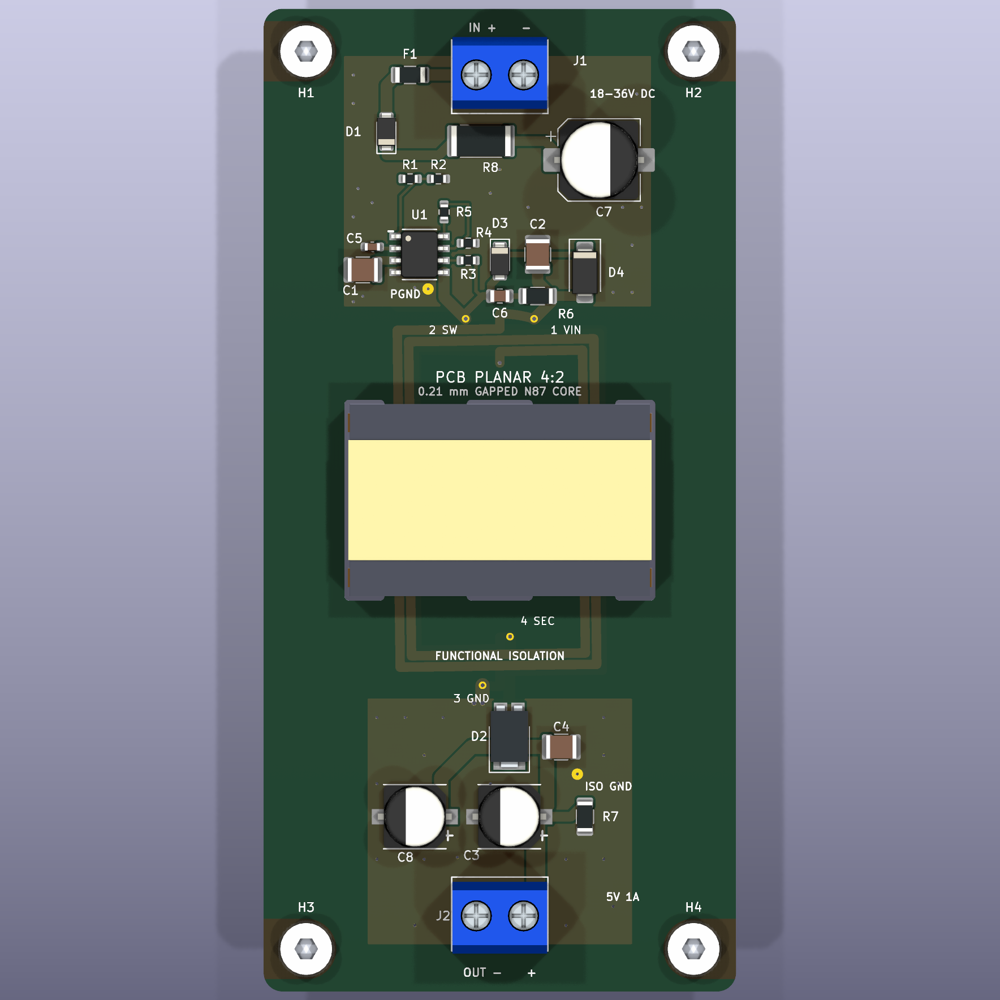

# Component and filtering audit — PS-FLYBACK-5W A1

Reviewed 2026-09-29. **Every placed footprint was reviewed: 24 electronic components, the custom transformer and four mounting holes.** Manufacturer part identity, package drawing, pin/polarity mapping, voltage/current/power ratings and intended circuit function were checked. Changes are incorporated in the native schematic and routed board.

**This remains an unbuilt engineering prototype.** The package/analytical review is complete; electrical suitability is conditional on the hardware and process tests identified below. The tightest outstanding electrical margin is RFB pin current during clamp spikes. Input hot-plug, magnetic losses, thermal performance and control behavior are not qualified. No supplier contact, purchase or fabrication release occurred.

[Per-component CSV](evidence/audit/component-audit.csv) · [Measured pads, pin nets and checks](evidence/audit/component-checks.json) · [Reviewed source records](sources/component-review.json) · [Current corner-mount revision](evidence/audit/mounting-revision-checks.json) · [Earlier component comparison](evidence/audit/component-revision-checks.json) · [Prototype test plan](manufacturing/PROTOTYPE-TEST-PLAN.md)

## Corrections implemented

| Reference | Change and reason |
| --- | --- |
| R1 | 681 kΩ → 649 kΩ. Improves the 18 V startup screening corner to 17.55 V including the input diode. Typical-only hysteresis prevents a guaranteed production-corner claim. |
| D1 | SS110/SMA → DFLS1100-7/PowerDI123, with a verified exact manufacturer drawing and polarity. |
| D4 | SMAJ13A → SMAJ12A-13-F. Rating-based SW clamp estimate falls from 58.5 to 56.9 V. Dynamic/temperature behavior still needs measurement. |
| C4 | Current manufacturer-confirmed Samsung CL32B226KOJNNNE output ceramic, same 1210 package. |
| C5 | Manufacturer-recommended CL10A475KO8NQNC replacement for the NRND bias capacitor. |
| C6 | Current 470 pF C0G 450 V TDK CGA4C4C0G2W471J060AA replaces the NRND 100 V selection, same 0805 package. |
| C7 + R8 | Add a 47 µF / 63 V hybrid reservoir through a 2.2 Ω / 1.5 W pulse-rated damping resistor in a shunt input branch. |
| C8 | Add a second 180 µF / 16 V polymer output capacitor. C3/C8 now provide 360 µF nominal, 288 µF at −20%, and 11 mΩ parallel ESR at 100 kHz. |
| PCB | Add 26 ground stitches plus two new capacitor return vias; expand front PGND copper. Keep all additions outside the winding/isolation region. |

The subsequent mounting-only revision moves all four holes to **4.5 mm corner insets**, forming a **41 × 95 mm** pattern. The upper row moves 12.5 mm away from C7; the lower row moves 2.5 mm toward the bottom corners. Electronic placement, routes, filled copper, winding geometry and board/core-slot outline are unchanged by that move. Current capacitor/hardware clearance measurements are in the mounting comparison linked above.

## Why add this filtering?

The prior bulk-only output ripple calculation was about 100 mV, with essentially no margin to the 100 mV target. With C8, the updated conservative worksheet estimates **50.58 mV** at worst full load, without crediting C4. This uses the same analytical method, not a measured result; the worksheet also now allows a conservative 1 V input-diode drop. The separate charge-balanced cycle model retains its nominal 0.6 V assumption and excludes loop/burst behavior.

C1/C2 remain close to U1 and the transformer terminal for high-frequency bypass. Their combined effective capacitance is provisionally taken as only 4 µF at high DC bias. C7 adds a low-frequency reservoir. R8 deliberately introduces loss in that capacitor branch so another low-ESR capacitor does not simply create an undamped cable/ceramic resonance. See [ADI AN88 on ceramic input capacitors and hot-plug](https://www.analog.com/media/en/technical-documentation/application-notes/an88f.pdf). R8 carries no steady converter load current.

The input capacitor ripple screening bound is 0.625 A versus C7's 1.1 A rating. Assigning all that ripple to R8 gives 0.869 W versus its 1.5 W rating at 70 °C. A 10 ms / 36 V ramp with C7 at +20% gives about 0.203 A charging current and 0.092 W in R8. A hard step can instead start near **595 W** with **36.55 mJ** stored in C7. Those figures explain why the initial test plan requires a controlled ramp: source impedance, cable inductance, pulse repetition and temperature have not been qualified. C7 is not a surge clamp; VIN must remain below 42 V.

No additional secondary LC stage was added: its control-loop and damping consequences would need a separate design. No primary-to-secondary capacitor was added; there is no defined EMI requirement that justifies increasing isolation capacitance.

## Placement, stitching and Perreault reference

Reviewed David Perreault's [MIT Power Electronics Research Group board gallery](https://per.mit.edu/project-gallery/) and his [ARPA-E power electronics presentation](https://arpa-e.energy.gov/sites/default/files/migrated/documents/files/PowerTech_Workshop_Perreault.pdf), especially the photographed 110 MHz Φ2 boost hardware on PDF page 11. The applicable visual lesson is a compact switching cell, nearby bypassing and short interconnects. That is an engineering inference from different research hardware, not an endorsement, a copied topology or a universal via-spacing rule.

The revised board applies those principles to this flyback: SW/clamp/snubber stay on F.Cu, C1-to-U1 is 2.92 mm, C5-to-U1 1.69 mm, RFB feed 1.72 mm, and C4 is 4.03 mm from the rectifier cathode. C8 receives its own 1.5 mm-wide, 12.69 mm cathode route. The R8-to-C7 route is 6.67 mm at 1.0 mm width. These are explicit track-centerline lengths; they exclude pad/plane spreading and do not claim extracted inductance.

There are **12 new PGND and 14 new GND_ISO stitches**, each 0.60 mm diameter / 0.30 mm drill. Independent checks verify their exact nets and solid annular attachment to both filled ground planes; none bridges the winding/isolation region. Including two added capacitor vias, ordinary vias rise from 33 to **61**. With five transformer interlayer holes, **66 holes require fill/cap**, while four connector holes remain open and four M3 holes remain NPTH. The four U1 thermal vias remain.

All 72 routed segments are orthogonal or 45°. Eight sampled return corridors remain within continuous ground copper. Four pours each have one connected filled outline. The schematic retains continuous power wiring and **zero four-way connections**; long capacitor values and diode labels were rearranged to remove collisions. Copper, masks, paste, legends, schematic crops and all five 3D views were visually reviewed after generation.

## Every component

“Reviewed” below means that the selected part/package and stated analytical use are supported by the linked source. It does not close the explicit hardware/process validation requirement. Limiting resistor voltage and rated power are separate constraints; allowable continuous voltage is the smaller of the limiting voltage and √(P·R), with temperature derating.

### C1 — CL32B106KBJNNNE

[Manufacturer/source](https://product.samsungsem.com/mlcc/CL32B106KBJNNN.do) · `C_1210_3225Metric`

**Rating:** 10 uF +/-10%, 50 V X7R, -55 to 125 C.

**Footprint and pin mapping:** Manufacturer 3.2 x 2.5 mm body matches 1210 (3225 metric), nonpolar lands; maximum height approximately 2.7 mm.

**Use and calculated stress:** Local VIN/U1 and transformer input bypass. 36 V DC is below 50 V. Combined effective capacitance assumed only 4 uF after bias and tolerance; typical manufacturer bias curve is approximately 2.8 uF each at 36 V.

**Remaining validation:** Confirm effective capacitance at voltage/temperature and ripple heating. A typical bias curve is not a guaranteed minimum. Keep actual VIN transients below the controller 42 V limit.

### C2 — CL32B106KBJNNNE

[Manufacturer/source](https://product.samsungsem.com/mlcc/CL32B106KBJNNN.do) · `C_1210_3225Metric`

**Rating:** 10 uF +/-10%, 50 V X7R, -55 to 125 C.

**Footprint and pin mapping:** Manufacturer 3.2 x 2.5 mm body matches 1210 (3225 metric), nonpolar lands; maximum height approximately 2.7 mm.

**Use and calculated stress:** Local VIN/U1 and transformer input bypass. 36 V DC is below 50 V. Combined effective capacitance assumed only 4 uF after bias and tolerance; typical manufacturer bias curve is approximately 2.8 uF each at 36 V.

**Remaining validation:** Confirm effective capacitance at voltage/temperature and ripple heating. A typical bias curve is not a guaranteed minimum. Keep actual VIN transients below the controller 42 V limit.

### C3 — 16SVPF180M

[Manufacturer/source](https://industrial.panasonic.com/ww/products/pt/os-con/models/16SVPF180M) · `CP_Panasonic_C6`

**Rating:** 180 uF +/-20%, 16 V polymer; 22 milliohm max ESR and 3.3 A ripple at 100 kHz; -55 to 105 C.

**Footprint and pin mapping:** Panasonic C6 case: 6.3 mm diameter x 5.9 mm. Custom lands 3.5 x 1.6 mm, centers +/-2.8 mm, 2.1 mm gap; match manufacturer recommended land drawing. Pad 1 is positive.

**Use and calculated stress:** Parallel output reservoirs: 360 uF nominal, 288 uF at -20%, 11 milliohm parallel ESR. 5.25 V maximum regulated target and 1.865 A total conservative capacitor RMS bound fit each part rating.

**Remaining validation:** Measure burst ripple, current sharing, startup/inrush and load-step response. ESR bound is specified at 100 kHz, not at every frequency or temperature.

### C4 — CL32B226KOJNNNE

[Manufacturer/source](https://product.samsungsem.com/mlcc/CL32B226KOJNNN.do) · `C_1210_3225Metric`

**Rating:** 22 uF +/-10%, 16 V X7R; -55 to 125 C.

**Footprint and pin mapping:** Current Samsung manufacturer listing; 3.2 x 2.5 mm 1210 body. Same nonpolar footprint as the previous part; replaces an inadequately supported old selection.

**Use and calculated stress:** Local rectifier/output high-frequency bypass. 5.25 V below 16 V; deliberately not credited in conservative output-capacity/ripple calculation.

**Remaining validation:** Confirm effective capacitance and temperature under ripple; verify procurement for this exact suffix.

### C5 — CL10A475KO8NQNC

[Manufacturer/source](https://product.samsungsem.com/mlcc/CL10A475KO8NQN.do) · `C_0603_1608Metric`

**Rating:** 4.7 uF +/-10%, 16 V X5R; -55 to 85 C.

**Footprint and pin mapping:** 1.6 x 0.8 mm 0603 nonpolar package; manufacturer recommended replacement for NRND CL10A475KO8NNNC.

**Use and calculated stress:** INTVCC decoupling, about 3.1 V maximum bias. Close 1.69 mm explicit feed to U1. LT8302 requires at least 1 uF effective local bypass.

**Remaining validation:** Verify >=1 uF after bias/tolerance/temperature and keep the capacitor below 85 C; nominal 4.7 uF alone does not establish effective capacitance.

### C6 — CGA4C4C0G2W471J060AA

[Manufacturer/source](https://product.tdk.com/en/search/capacitor/ceramic/mlcc/info?part_no=CGA4C4C0G2W471J060AA) · `C_0805_2012Metric`

**Rating:** 470 pF +/-5%, 450 V C0G; -55 to 125 C.

**Footprint and pin mapping:** TDK production part, 2.0 x 1.25 x 0.6 mm nominal 0805. Replaces NRND 100 V CGA4C2C0G2A471J060AA without changing capacitance or lands.

**Use and calculated stress:** Series RC snubber capacitor from SNUB to SW; conservative 60 V amplitude is below 450 V; stable dielectric avoids MLCC bias loss in tuning.

**Remaining validation:** Tune using measured ringing and verify resistor loss; voltage rating alone does not qualify repetitive switching-current/EMI behavior.

### C7 — EEHZC1J470P

[Manufacturer/source](https://industrial.panasonic.com/ww/products/pt/hybrid-aluminum/models/EEHZC1J470P) · `CP_Elec_8x10.5`

**Rating:** 47 uF +/-20%, 63 V hybrid; 40 milliohm max ESR; 1.1 A ripple at 100 kHz/125 C; -55 to 125 C.

**Footprint and pin mapping:** Manufacturer 8 mm diameter x 10.2 +/-0.3 mm body uses polarized 8 mm electrolytic lands. 10.5 mm stock model is the maximum-height envelope, not a different capacitor. Pad 1 positive; square/chamfer polarity marks verified.

**Use and calculated stress:** Input reservoir in VIN -> R8 -> C7 -> PGND shunt branch; 36 V and full converter capacitor-ripple bound approximately 0.63 A are below ratings.

**Remaining validation:** This is not a surge clamp. Validate cable/source impedance, hot-plug, ESR over temperature and ripple heating; begin with controlled input ramp.

### C8 — 16SVPF180M

[Manufacturer/source](https://industrial.panasonic.com/ww/products/pt/os-con/models/16SVPF180M) · `CP_Panasonic_C6`

**Rating:** 180 uF +/-20%, 16 V polymer; 22 milliohm max ESR and 3.3 A ripple at 100 kHz; -55 to 105 C.

**Footprint and pin mapping:** Panasonic C6 case: 6.3 mm diameter x 5.9 mm. Custom lands 3.5 x 1.6 mm, centers +/-2.8 mm, 2.1 mm gap; match manufacturer recommended land drawing. Pad 1 is positive.

**Use and calculated stress:** Parallel output reservoirs: 360 uF nominal, 288 uF at -20%, 11 milliohm parallel ESR. 5.25 V maximum regulated target and 1.865 A total conservative capacitor RMS bound fit each part rating.

**Remaining validation:** Measure burst ripple, current sharing, startup/inrush and load-step response. ESR bound is specified at 100 kHz, not at every frequency or temperature.

### D1 — DFLS1100-7

[Manufacturer/source](https://www.diodes.com/datasheet/download/DFLS1100.pdf) · `D_PowerDI-123`

**Rating:** 100 V reverse; 1 A average, 0.8 A after 20% capacitive-load derating; 50 A nonrepetitive 8.3 ms surge.

**Footprint and pin mapping:** PowerDI123 asymmetric lands: large pad 1 is cathode, small pad 2 anode. Replaces the insufficiently traceable SS110 selection and its SMA footprint.

**Use and calculated stress:** Series input reverse-polarity protection; approximately 0.40 A forward and at most 72 V conservative reverse with a charged 36 V reservoir and -36 V input.

**Remaining validation:** Measure temperature and inrush. Datasheet thermal resistance assumes its stated copper/test conditions, not this six-layer board.

### D2 — PDS835L-13

[Manufacturer/source](https://www.diodes.com/datasheet/download/PDS835L.pdf) · `D_PowerDI-5`

**Rating:** 35 V reverse, 8 A average under datasheet thermal conditions.

**Footprint and pin mapping:** Manufacturer PowerDI5 drawing: large cathode pad 1 and two physical anode pads numbered 2. Custom copper matches 4.86 x 3.36 mm cathode and 1.40 x 1.39 mm anode lands.

**Use and calculated stress:** Secondary rectifier. Worst ideal reverse is 23.25 V before overshoot; average full-load approximately 1.023 A including preload. Conservative 6.48 A fault-average screening value is below 8 A.

**Remaining validation:** Measure reverse spikes <30 V prototype target and junction temperature. 8 A catalog rating and transient surge numbers are not unconditional PCB thermal/fault qualification.

### D3 — DFLS1100-7

[Manufacturer/source](https://www.diodes.com/datasheet/download/DFLS1100.pdf) · `D_PowerDI-123`

**Rating:** 100 V reverse, 1 A average, 2 A RMS under stated conditions; 50 A nonrepetitive surge.

**Footprint and pin mapping:** PowerDI123 cathode pad 1 faces CLAMP; anode pad 2 faces SW. Asymmetric package/pad mapping checked against the exact Diodes drawing.

**Use and calculated stress:** Steers leakage current into the TVS only while SW exceeds VIN plus clamp voltage; primary full-load peak approximately 2.065 A is a brief pulse, not continuous average current.

**Remaining validation:** Measure clamp pulse width, average/RMS current and junction temperature with measured leakage inductance. Surge rating must not be used as repetitive-current permission.

### D4 — SMAJ12A-13-F

[Manufacturer/source](https://www.diodes.com/datasheet/download/SMAJ5.0A.pdf) · `D_SMA`

**Rating:** 12 V standoff, 13.3-14.7 V breakdown, 19.9 V clamp at 20.1 A / 10-1000 us; 400 W pulse rating.

**Footprint and pin mapping:** Unidirectional SMA / DO-214AC. Cathode pad 1 CLAMP, anode pad 2 VIN. The A suffix matters; bidirectional CA is not the reviewed substitution.

**Use and calculated stress:** Replaces 13 V TVS to reduce rating-based SW clamp from 58.5 to 56.9 V at VIN=36 V including 1 V D3. Ideal reflected plateau <=11.7 V remains below 12 V standoff.

**Remaining validation:** Small RFB injected-current margin remains: SW-VIN <20.5 V, SW <60 V on prototypes. TVS voltage varies with pulse current/temperature; 400 W is not a continuous dissipation rating.

### F1 — 0466001.NR

[Manufacturer/source](https://www.littelfuse.com/assetdocs/littelfuse_fuse_466_datasheet?assetguid=dbe9bcd7-6072-4adf-bf5b-d33e52a6b90f) · `Fuse_1206_3216Metric`

**Rating:** 1 A, 63 V AC/DC, fast; 50 A interrupt; nominal cold resistance 0.075 ohm, nominal melting I2t 0.0423 A2s.

**Footprint and pin mapping:** 1206 body 3.175 x 1.524 mm nominal matches the selected metric fuse footprint. Generic KiCad land geometry is not represented as an exact manufacturer stencil recommendation.

**Use and calculated stress:** Input average approximately 0.40 A; 0.75 application factor and approximately 0.8 temperature factor at 70 C give 0.60 A continuous screening capacity.

**Remaining validation:** Verify inrush and time-current coordination. Source fault current must not exceed 50 A for the stated interrupt rating; this fuse does not guarantee semiconductor protection.

### H1 — M3 Edge mounting interface

[Manufacturer/source](https://github.com/American-Embedded/American_Embedded_KiCad_Repository/blob/7be291853536e19f0d0d548c2ed3ca6811bdc540/packages/library/american-embedded-library/footprints/amemb-MountingHole.pretty/MountingHole_3.2mm_M3_ExposedSubstrate_Edge.kicad_mod) · `MountingHole_3.2mm_M3_ExposedSubstrate_Edge`

**Rating:** M3 clearance: 3.2 mm NPTH, 6.4 mm exposed-substrate diameter plus outward extension; 6.8 mm circular copper keepout.

**Footprint and pin mapping:** Exact American Embedded Edge footprint at commit 7be2918; H1/H3 rotated 180 degrees, H2/H4 0 degrees; 41 x 95 mm hole pattern; centers 4.5 mm from adjacent board edges. No electrical pad/net.

**Use and calculated stress:** Mechanical support, excluded from electronic BOM/CPL. Provisional nonconductive M3 hardware uses 8 mm standoffs for underside core clearance.

**Remaining validation:** Select actual screws/standoffs and qualify contact diameter, enclosure clearances and torque; 3D fasteners are illustrative envelopes.

### H2 — M3 Edge mounting interface

[Manufacturer/source](https://github.com/American-Embedded/American_Embedded_KiCad_Repository/blob/7be291853536e19f0d0d548c2ed3ca6811bdc540/packages/library/american-embedded-library/footprints/amemb-MountingHole.pretty/MountingHole_3.2mm_M3_ExposedSubstrate_Edge.kicad_mod) · `MountingHole_3.2mm_M3_ExposedSubstrate_Edge`

**Rating:** M3 clearance: 3.2 mm NPTH, 6.4 mm exposed-substrate diameter plus outward extension; 6.8 mm circular copper keepout.

**Footprint and pin mapping:** Exact American Embedded Edge footprint at commit 7be2918; H1/H3 rotated 180 degrees, H2/H4 0 degrees; 41 x 95 mm hole pattern; centers 4.5 mm from adjacent board edges. No electrical pad/net.

**Use and calculated stress:** Mechanical support, excluded from electronic BOM/CPL. Provisional nonconductive M3 hardware uses 8 mm standoffs for underside core clearance.

**Remaining validation:** Select actual screws/standoffs and qualify contact diameter, enclosure clearances and torque; 3D fasteners are illustrative envelopes.

### H3 — M3 Edge mounting interface

[Manufacturer/source](https://github.com/American-Embedded/American_Embedded_KiCad_Repository/blob/7be291853536e19f0d0d548c2ed3ca6811bdc540/packages/library/american-embedded-library/footprints/amemb-MountingHole.pretty/MountingHole_3.2mm_M3_ExposedSubstrate_Edge.kicad_mod) · `MountingHole_3.2mm_M3_ExposedSubstrate_Edge`

**Rating:** M3 clearance: 3.2 mm NPTH, 6.4 mm exposed-substrate diameter plus outward extension; 6.8 mm circular copper keepout.

**Footprint and pin mapping:** Exact American Embedded Edge footprint at commit 7be2918; H1/H3 rotated 180 degrees, H2/H4 0 degrees; 41 x 95 mm hole pattern; centers 4.5 mm from adjacent board edges. No electrical pad/net.

**Use and calculated stress:** Mechanical support, excluded from electronic BOM/CPL. Provisional nonconductive M3 hardware uses 8 mm standoffs for underside core clearance.

**Remaining validation:** Select actual screws/standoffs and qualify contact diameter, enclosure clearances and torque; 3D fasteners are illustrative envelopes.

### H4 — M3 Edge mounting interface

[Manufacturer/source](https://github.com/American-Embedded/American_Embedded_KiCad_Repository/blob/7be291853536e19f0d0d548c2ed3ca6811bdc540/packages/library/american-embedded-library/footprints/amemb-MountingHole.pretty/MountingHole_3.2mm_M3_ExposedSubstrate_Edge.kicad_mod) · `MountingHole_3.2mm_M3_ExposedSubstrate_Edge`

**Rating:** M3 clearance: 3.2 mm NPTH, 6.4 mm exposed-substrate diameter plus outward extension; 6.8 mm circular copper keepout.

**Footprint and pin mapping:** Exact American Embedded Edge footprint at commit 7be2918; H1/H3 rotated 180 degrees, H2/H4 0 degrees; 41 x 95 mm hole pattern; centers 4.5 mm from adjacent board edges. No electrical pad/net.

**Use and calculated stress:** Mechanical support, excluded from electronic BOM/CPL. Provisional nonconductive M3 hardware uses 8 mm standoffs for underside core clearance.

**Remaining validation:** Select actual screws/standoffs and qualify contact diameter, enclosure clearances and torque; 3D fasteners are illustrative envelopes.

### J1 — KF301-5.0-2P

[Manufacturer/source](https://www.cxkefa.com/kf301-50) · `Terminal_KF301_2P_5.00`

**Rating:** 300 V; use conservative 10 A rating (approval-dependent); -30 to 120 C; 22-14 AWG.

**Footprint and pin mapping:** Manufacturer drawing: 5.00 mm pitch, 1.00 mm round leads, recommended 1.30 mm holes. Actual 5.00 mm pitch / 1.30 mm drills / 2.40 mm lands. Pin 1 positive, pin 2 return; wire entries face outward.

**Use and calculated stress:** 36 V input at approximately 0.40 A or 5 V output at 1 A is within electrical ratings.

**Remaining validation:** Qualify wire range, solder fill, 0.4 Nm screw torque, tool access and manual assembly.

### J2 — KF301-5.0-2P

[Manufacturer/source](https://www.cxkefa.com/kf301-50) · `Terminal_KF301_2P_5.00`

**Rating:** 300 V; use conservative 10 A rating (approval-dependent); -30 to 120 C; 22-14 AWG.

**Footprint and pin mapping:** Manufacturer drawing: 5.00 mm pitch, 1.00 mm round leads, recommended 1.30 mm holes. Actual 5.00 mm pitch / 1.30 mm drills / 2.40 mm lands. Pin 1 positive, pin 2 return; wire entries face outward.

**Use and calculated stress:** 36 V input at approximately 0.40 A or 5 V output at 1 A is within electrical ratings.

**Remaining validation:** Qualify wire range, solder fill, 0.4 Nm screw torque, tool access and manual assembly.

### R1 — RC0603FR-07649KL

[Manufacturer/source](https://www.yageogroup.com/component-documentation/download/specsheet/RC0603FR-07649KL) · `R_0603_1608Metric`

**Rating:** 649 kohm +/-1%, 0.1 W at 70 C, 75 V limiting element voltage.

**Footprint and pin mapping:** 0603 / 1.6 x 0.8 mm resistor lands; no polarity.

**Use and calculated stress:** Upper UVLO divider. Reduced from 681 kohm: 17.55 V connector startup screening corner, including resistor/threshold/current limits and 1 V diode drop. At 42 V, less than 2.8 mW even assigning full voltage to R1.

**Remaining validation:** UVLO hysteresis is only typical in the datasheet: verify startup at 18 V, full load and 0-50 C; this calculation is not a guaranteed production corner.

### R2 — RC0603FR-0761K9L

[Manufacturer/source](https://www.yageogroup.com/component-documentation/download/specsheet/RC0603FR-0761K9L) · `R_0603_1608Metric`

**Rating:** 61.9 kohm +/-1%, 0.1 W at 70 C, 75 V limiting element voltage.

**Footprint and pin mapping:** 0603 / 1.6 x 0.8 mm resistor lands; no polarity.

**Use and calculated stress:** Lower UVLO divider. Under 3.7 V and 0.23 mW for VIN <=42 V. Nominal UVLO after D1 is 15.73 V rising / 13.94 V falling with R1.

**Remaining validation:** Verify startup threshold/hysteresis and resistor substitution tolerances with R1.

### R3 — RT0603BRD07106KL

[Manufacturer/source](https://www.yageogroup.com/component-documentation/download/specsheet/RT0603BRD07106KL) · `R_0603_1608Metric`

**Rating:** 106 kohm +/-0.1%, 25 ppm/C, 0.1 W at 70 C, 75 V limiting element voltage.

**Footprint and pin mapping:** Exact Yageo RT spec sheet confirms 0603 thin-film part and tolerance; previous unrelated source link replaced. Pad 1 SW, pad 2 RFB.

**Use and calculated stress:** Reflected-voltage sensing; R3/R4/2 - diode-drop relation gives nominal 5 V. Even assigning 60 V continuously gives <34 mW; RFB pin current, not resistor heating, sets the tighter constraint.

**Remaining validation:** At the rating-based 19.9 V TVS clamp plus 1 V diode and 50 mV sense offset, approximately 197.84 uA versus 200 uA absolute pin limit. Scope SW-VIN <20.5 V; qualify temperature/dynamic peaks and final output trim.

### R4 — RT0603BRD0710KL

[Manufacturer/source](https://www.yageogroup.com/component-documentation/download/specsheet/RT0603BRD0710KL) · `R_0603_1608Metric`

**Rating:** 10 kohm +/-0.1%, 25 ppm/C, 0.1 W at 70 C, 75 V limiting element voltage.

**Footprint and pin mapping:** Exact Yageo 0603 thin-film spec sheet, correct 10 kohm reference part.

**Use and calculated stress:** RREF to PGND establishes the controller reference. At an intentionally conservative 2 V, 0.4 mW; the actual reference is approximately 1 V.

**Remaining validation:** Retain tolerance and temperature coefficient; confirm output ratio and thermal regulation with R3/R5.

### R5 — RC0603FR-07118KL

[Manufacturer/source](https://www.yageogroup.com/component-documentation/download/specsheet/RC0603FR-07118KL) · `R_0603_1608Metric`

**Rating:** 118 kohm +/-1%, 0.1 W at 70 C, 75 V limiting element voltage.

**Footprint and pin mapping:** 0603 resistor lands; no polarity.

**Use and calculated stress:** TC-to-RREF temperature compensation, not a supply bias resistor. Even 2 V differential is <35 uW.

**Remaining validation:** Value is an initial compensation setting. Tune against rectifier forward-drop versus temperature and actual regulation data.

### R6 — ERJ-P08F39R0V

[Manufacturer/source](https://industrial.panasonic.com/cdbs/www-data/pdf/RDO0000/AOA0000C331.pdf) · `R_1206_3216Metric`

**Rating:** 39 ohm +/-1%, 0.66 W; pulse-withstanding Panasonic ERJ-P08; full-rating terminal temperature <=125 C.

**Footprint and pin mapping:** 1206 / 3.2 x 1.6 mm lands match ERJ-P08. Documentation corrected from approximate 0.667 W to specified 0.66 W.

**Use and calculated stress:** Series RC damping of SW ringing. Full-load C*V^2*f estimate approximately 0.485 W, below 0.66 W. This consumes substantial thermal margin.

**Remaining validation:** Measure repetitive pulse amplitude and dissipation, apply terminal-temperature derating. The 500 V limiting-element specification does not allow 500 V DC across 39 ohm.

### R7 — RC1206FR-07220RL

[Manufacturer/source](https://www.yageogroup.com/component-documentation/download/specsheet/RC1206FR-07220RL) · `R_1206_3216Metric`

**Rating:** 220 ohm +/-1%, 0.25 W at 70 C, 200 V limiting element voltage.

**Footprint and pin mapping:** 1206 / 3.2 x 1.6 mm resistor lands; no polarity.

**Use and calculated stress:** Minimum-load resistor. Worst 0.12655 W at 5.25 V / -1% resistance; minimum 21.38 mA at 4.75 V exceeds estimated 19.87 mA minimum-energy load requirement.

**Remaining validation:** Verify no-load burst ripple and temperature; derate above 70 C. Minimum switching timing/hysteresis assumptions need hardware confirmation.

### R8 — CRCW25122R20FKEGHP

[Manufacturer/source](https://www.vishay.com/docs/20043/crcwhpe3.pdf) · `R_2512_6332Metric`

**Rating:** 2.2 ohm +/-1%, 1.5 W at 70 C ambient; pulse-proof CRCW-HP e3.

**Footprint and pin mapping:** 2512 / 6.3 x 3.2 mm lands match the exact Vishay high-pulse package; larger than the snubber resistor deliberately.

**Use and calculated stress:** Damping resistance only in C7 shunt branch; no DC converter load flows through it. Screening bound assigning all input ripple to it is <0.9 W. A 10 ms, 36 V ramp charges C7 at <=0.204 A, approximately 0.093 W.

**Remaining validation:** A hard step can demand roughly 595 W initially and 36.55 mJ at C7 +20%; pulse graph, repetition, thermal and source dynamics require qualification. Do not assume hot-plug is qualified.

### T1 — PS-MAG-001 A0

[Manufacturer/source](https://www.tdk-electronics.tdk.com/inf/80/db/fer/elp_32_6_20.pdf) · `Planar_EELP32_4T_2T`

**Rating:** Prepared TDK N87 EELP32 pair, nominal 0.21 mm center-only gap; 4:2 turns; nominal primary 11.95 uH, acceptance 10.16-13.74 uH.

**Footprint and pin mapping:** Custom integral winding footprint, five 0.40 mm plated interlayer holes. Two primary layers series, two secondary layers parallel. Primary dot pad 1, secondary dot pad 3 (GND_ISO), pad 5 internal series connection.

**Use and calculated stress:** Flyback energy-storage transformer, not an ungapped signal transformer. Estimated flux 0.145 T at 5.4 A and L+15%; typical 7.2 A overcurrent-restart value gives 0.193 T.

**Remaining validation:** Custom magnetic assembly remains unqualified: measure L versus DC bias/temperature, leakage, core/fringing/AC losses, gap tolerance and retention. Functional low-voltage isolation only; no safety rating.

### U1 — LT8302ES8E#PBF

[Manufacturer/source](https://www.analog.com/en/products/lt8302.html) · `SOIC8_EP_LT_S8E`

**Rating:** LT8302 (not -3), E grade guaranteed 0-125 C junction range; VIN abs max 42 V, SW abs max 65 V; 3.6 A minimum / 5.4 A maximum peak-current limit.

**Footprint and pin mapping:** ADI S8E exposed-pad SOIC8: 1.27 mm lead pitch; lands 1.143 x 0.760 mm, EP 2.26 x 2.99 mm; four paste windows and four filled/capped EP vias. Nine electrical pad numbers including EP.

**Use and calculated stress:** Primary-side regulated low-voltage isolated flyback. Pin map: 1 UVLO, 2 INTVCC, 3 VIN, 4 PGND, 5 SW, 6 RFB, 7 RREF, 8 TC, 9 PGND. Full-load 2.065 A peak below 3.6 A minimum limit.

**Remaining validation:** No mains use. Measure temperature (<110 C junction target), VIN<42 V, SW<60 V and RFB current<200 uA including transients. Validate startup, burst, stability, overload and output trim.

## Separate assembly materials

The electronic BOM intentionally excludes the integral T1 winding, its separately quoted core operation and provisional mounting hardware. The [core materials schedule](manufacturing/CORE-BOM.csv) is also part of this review:

- **Two TDK B66457G0000X187 N87 halves:** stock ungapped parts require a qualified center-leg grinding process to produce PS-MAG-001 A0. Verify dimensions, seating, measured inductance and biased/thermal behavior; a full-face shim is not an equivalent substitution.
- **LOCTITE AA 330 plus SF 7387 activator:** [Henkel's adhesive data](https://datasheets.tdx.henkel.com/LOCTITE-AA-330-en_GL.pdf) supports ferrite bonding as a candidate process. External bond geometry, activation/cure, stress and compatibility with the laminate/core remain unqualified. Neither adhesive nor 3D bond envelope is a safety-insulation claim.
- **3M 69, 12.7 mm strap:** [manufacturer product data](https://www.3m.com/3M/en_US/p/d/v000076478/) supports the proposed nonconductive glass-cloth retention material. Its actual wrap, clearance, aging and mechanical retention require qualification. It is not credited toward a safety-isolation rating.
- **M3 fasteners/standoffs:** the displayed nonconductive 8 mm hardware remains a geometry envelope, not a procured part. Qualify the final hardware before installation.

## Most important unresolved gates

1. **RFB/clamp margin:** the specified TVS clamp plus diode-drop estimate gives 197.84 µA versus the 200 µA absolute pin limit. This is too close to treat as qualification. Measure differential SW−VIN <20.5 V, SW <60 V, and verify clamp temperature at line/load/temperature extremes; retune before release if limits are exceeded.
2. **Input transients and startup:** controlled ramp first; VIN <42 V; confirm cold 18 V full-load start. Qualify abrupt connection separately, including fuse, diode and R8 pulse stress.
3. **Thermal and magnetic behavior:** measure core/fringing/AC losses, inductance under bias, semiconductor temperatures, R6/R8 dissipation and capacitor ripple temperatures. Nominal catalog ratings do not establish board thermal capacity.
4. **Output behavior:** confirm ripple, burst, load steps, overload recovery, final voltage trim and temperature compensation with 360 µF output bulk.
5. **Manufacturing:** confirm the exact parts, paste/solder process, via fill/cap, proposed stack, custom prepared core and retention. Empty sourcing codes are deliberate where a new exact code was not verified. Catalog existence does not establish available stock or turnkey acceptance.

## Evidence and reproduction

ERC reports zero messages. DRC reports zero violations, unconnected items or schematic-parity issues. Independent checks match 60 logical pins to 61 numbered pads and preserve the four winding polygons/19,229 samples. All 29 footprints have bundled models; 16 STEP assets are valid and 406 component-pair plus 29 substrate checks have no nominal positive-volume intersections.

Run `scripts/rebuild.py`, refresh Gerber renders, then `audit-layout.py`, `audit-layout-complete.py`, `audit-components.py` and `render-component-audit.py`. The last two use KiCad Python and the human-reviewed `sources/component-review.json`; a changed MPN/package/pin mapping fails the applicability check and requires new review. The component comparison against 9bc0614 is historical. Run `audit-mounting-revision.py --baseline-board PATH --baseline-id COMMIT` against the preceding 007bcb5 board for the current corner move. Renew CadQuery solid checks, schematic renders and the manifest before publication. Historical evidence is explicitly marked and is not proof of the current board.
