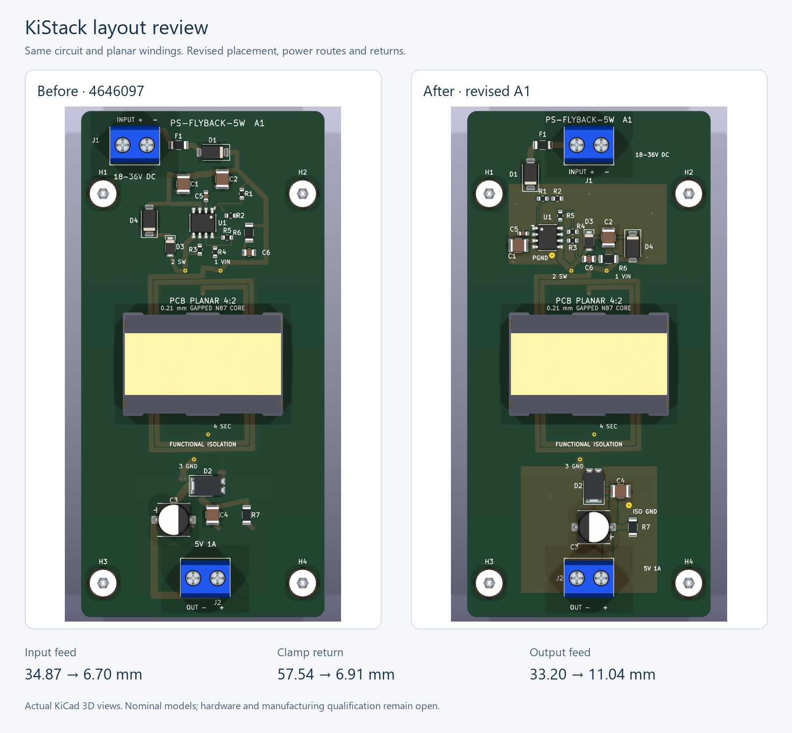
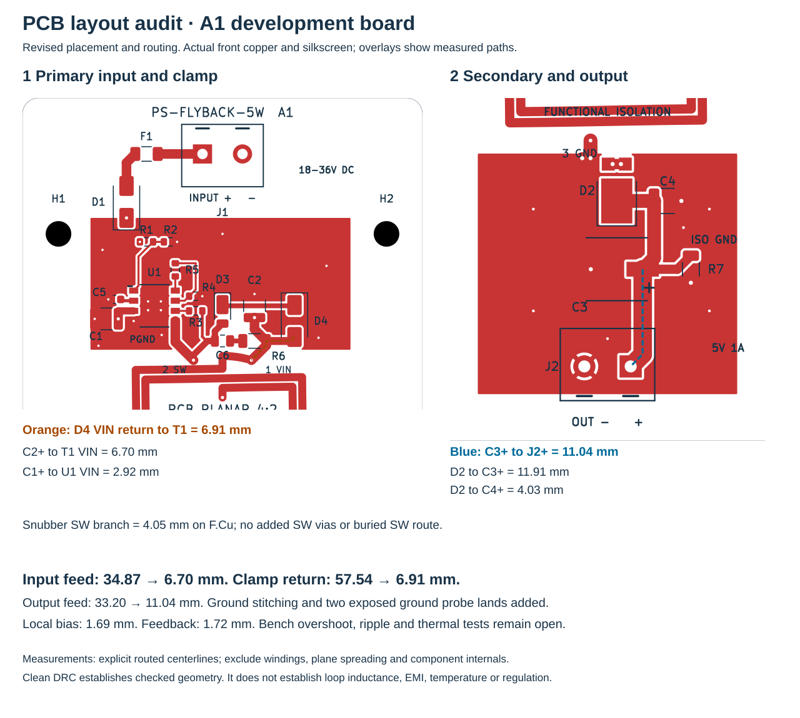

# PCB layout audit — PS-FLYBACK-5W A1

**The power-stage placement and routing have been revised.** The previous long
input, clamp and output paths are corrected; ERC, DRC, connectivity, winding and
nominal mechanical checks pass. Hardware validation and supplier acceptance
remain open. This is an unbuilt engineering prototype, not a production release.

Reviewed 2026-09-29 following the pinned [KiStack PCB, layout and Gerber workflows](KISTACK-AUDIT.md).
The before image and measurements are from commit
`46460970e0e223c8738fd1d8be9bf6b80ef8369b`. Current evidence records the actual
saved PCB hash. No supplier was contacted and no purchase was made.

## Placement and power routing

Input protection feeds a compact controller/primary-terminal cluster. C1 now
bypasses U1 locally; C2 is beside the transformer VIN terminal. D3/D4 and R6/C6
share short local connections around T1. SW and CLAMP routes stay on F.Cu, with
**no added SW vias**. In3.Cu now carries a quiet VIN feed instead of the buried
SW/snubber branch. The rectifier faces the secondary terminals; C4 is beside its
output, and C3 feeds an aligned edge connector through a 2 mm trace.

| Measured connection | Before | After | Minimum width now |
| --- | ---: | ---: | ---: |
| Input capacitor C2 → T1 VIN | 34.87 mm | **6.70 mm** | 1.20 mm |
| Local bypass C1 → U1 VIN | 16.87 mm | **2.92 mm** | 0.90 mm |
| U1 SW → T1 | 7.89 mm | 5.84 mm | 1.20 mm |
| Clamp D4 → T1 VIN | 57.54 mm | **6.91 mm** | 1.00 mm |
| T1 SW → snubber C6 | 17.78 mm | **4.05 mm** | 0.80 mm |
| Snubber R6 → T1 VIN | 21.26 mm | 3.17 mm | 1.20 mm |
| Bias C5 → U1 INTVCC | 2.12 mm | 1.69 mm | 0.40 mm |
| Feedback R3 → U1 RFB | 2.07 mm | 1.72 mm | 0.25 mm |
| Rectifier D2 → ceramic C4 | 5.61 mm | 4.03 mm | 1.50 mm |
| Rectifier D2 → bulk C3 | 11.98 mm | 11.91 mm | 1.50 mm |
| Bulk C3 → output J2 | 33.20 mm | **11.04 mm** | 2.00 mm |

The layout is a tradeoff: the T1-to-D3 branch grew from 5.46 to 6.62 mm and
D3-to-D4 from 6.85 to 9.10 mm. The three explicit clamp connections together
fell from 69.85 to 22.64 mm. The D2-to-bulk-capacitor connection is essentially
unchanged. The full [15-path comparison](evidence/audit/complete-layout-checks.json)
includes those increases.

These are explicit trace-centerline lengths, excluding winding length,
component internals, plane/pad current spreading and via height. They are not
loop inductance or manufacturer trace-length limits. Placement follows the local
bypass and short SW/RFB guidance in the [LT8302 Rev G datasheet](https://www.analog.com/media/en/technical-documentation/data-sheets/lt8302-8302-3.pdf).
Actual overshoot, EMI, regulation and temperature still need measurement.

## Complete layout review

| Area | Review and result | Remaining limit |
| --- | --- | --- |
| Placement and appearance | Connector body axes align at x=100 mm, with wire entries facing opposite board ends. Electronics follow input → controller/primary → transformer → rectifier/filter → output. References are horizontal; legends and polarities were checked in copper, assembly and 3D views. | Enclosure, cable bends and screwdriver access have not been supplied. |
| Primary switching paths | Local C1/C2 and suppression placement replaces long perimeter returns. SW and CLAMP stay on F.Cu. CLAMP crosses between C2 pads with native clearance verified. | No extracted parasitics or current-density solution; clamp tuning remains a bench task. |
| Secondary current paths | D2 anodes face T1; parallel escape vias remain adjacent to its anode pads. C4 is beside D2, with C3 above J2. Output feed is 2 mm wide and 11.04 mm long. | Confirm rectifier temperature and drop/ripple at both C3 and J2. |
| Return copper | Separate PGND and GND_ISO regions occupy both outer layers, with five additional stitching vias in each domain. Each of the four filled regions has one connected outline. U1 retains four exposed-pad ground vias. | Connected copper alone does not prove low impedance or favorable current sharing. |
| Return-path detail | Six 0.5 mm projected B.Cu corridors were sampled between capacitor/reference grounds and controller/secondary return. Four are straight. C1 and C4 require detours around power-via antipads; reviewed routes are 8.30 and 11.76 mm, versus 7.65 and 10.84 mm straight-line distances. All six reviewed corridors stay inside filled copper. | Feasible geometric paths, not predictions of current flow. Endpoint spreading and via impedance are excluded. |
| Bias, feedback and reference | C5-to-U1 is 1.69 mm; R3-to-RFB 1.72 mm; U1 RREF-to-R4 1.96 mm. R4 returns through nearby PGND. Quiet signals stay within the local controller cluster. | Output trim and temperature compensation must be retested after the placement change. |
| Circuit and windings | Same 26 component identities and 55 numbered pad/net/size/drill/shape records. T1 pose and copper, 19,229 winding samples, outline, core slots, thickness and six layers preserved. | Nominal magnetic calculations do not establish biased inductance, fringing or core loss. |
| Isolation | PGND and GND_ISO remain separate. Local ground regions stop outside the winding area. Existing net ties preserve series primary and parallel secondary sections. | Proposed 0.10 mm outer interlayer dielectrics and 0.20 mm clearance rules provide no safety-isolation rating. |
| Tracks and vias | All 64 routed segments are orthogonal or 45°. Minimum routed width is 0.25 mm; ordinary via annular ring is at least 0.15 mm. Native DRC reports no clearance or connection violations. | Fabricator must accept copper, drill and registration tolerances. |
| Thermal and soldering | Four filled/capped U1 thermal vias and four paste windows remain. J1/J2 ground pins now use 0.30 mm thermal gaps and 0.50 mm spokes. Separate ground copper spreads heat locally. | No thermal simulation or temperature measurements; paste/process and solderability need validation. |
| Probe access | Two new exposed 1.2 mm filled/capped ground lands, plus mapped VIN, SW, INTVCC and output component pads. PGND land is about 2.44 mm from U1 SW pin. No added SW stub. | Component pads require fine probes; no installed test-point components were added. |
| Mounting and core | Four American Embedded 3.2 mm NPTH holes and 41 × 80 mm pattern retained. All-layer copper exclusion and drilled coordinates pass. T1 courtyard tightened around its unchanged winding/terminal extent; no courtyard overlaps. | Core preparation/retention and actual M3 hardware remain provisional. |
| Models and fit | All 26 footprints have visible local models; 14 STEP assets are valid. All 325 component pairs have disjoint conservative bounding boxes; 26 exact substrate checks have zero positive-volume intersections. Core clears nominal substrate by 0.318 mm. | Nominal models do not establish tolerance-stack, enclosure or process acceptance. |
| Masks, paste and legends | Reviewed six copper Gerbers, both masks, front paste, both legends and outline. New ground lands are exposed only on top, without paste. Connector and M3 holes have no paste. Four U1 paste windows are present. | Images supplement native geometry checks; vendor CAM review remains open. |
| Manufacturing consistency | 21 electronic BOM/CPL references (19 SMD, two THT) match. Revised placements and connector centroids exported. **38 filled/capped interlayer holes + four open connector holes = 42 plated holes**, plus four separate NPTH holes. | Panel fiducials/tooling, via fill/cap, stack and core installation need supplier acceptance. |

Return-plane areas in [complete-layout-checks.json](evidence/audit/complete-layout-checks.json):
PGND F/B = 413.83/842.55 mm²; GND_ISO F/B = 630.53/711.54 mm².
Areas are descriptive, not an estimate of thermal capacity or current rating.

## Probe map and unresolved release gates

| Signal | Physical access | Return |
| --- | --- | --- |
| VIN | Existing T1 pad 1 | New PGND land at (92.40, 62.65) mm |
| SW | Existing T1 pad 2; U1 pin 5 for switch-side measurement | Same PGND land; use the shortest suitable probe loop |
| INTVCC / BIAS | C5 pad 1 | PGND |
| Output | C4 pad 1 for local ripple; J2 pin 1 for delivered output | New ISO GND land at (108.20, 114.00) mm |

Coordinates are native KiCad coordinates. See the [probe map](evidence/audit/probe-sites.json)
and [prototype test plan](manufacturing/PROTOTYPE-TEST-PLAN.md). Keep primary and
secondary probe returns separate.

Before fabrication release, obtain stack/via-fill/core-process acceptance and
review actual hardware, wiring and enclosure constraints. On prototypes, verify
switch overshoot, rectifier stress, ripple, output trim/regulation, startup,
load transients, overload, biased inductance, temperature and EMI. The previous
58.5 V rating-based clamp estimate and approximately 100 mV bulk-only ripple
calculation still leave little margin; shorter routing is not a measured pass.

## Evidence and reproduction

- [Circuit/geometry preservation](evidence/audit/layout-revision-checks.json), [baseline route snapshot](evidence/audit/layout-before.json)
- [Current route detail](evidence/audit/pcb-layout-metrics.json), [complete geometry checks](evidence/audit/complete-layout-checks.json)
- [Front/back view](evidence/layout-overview.svg), [six copper layers](evidence/audit/gerber-copper-overview.png), [technical layers](evidence/audit/gerber-technical-overview.png)
- [DRC](evidence/board-drc.json), [net/winding checks](evidence/independent-checks.json), [manufacturing checks](evidence/manufacturing-checks.json), [mounting checks](evidence/audit/mounting-checks.json)
- [Model sources, five views and solid checks](3D-MODELS.md), [render provenance](evidence/audit/render-provenance.json)

Run the normal [rebuild](README.md), then `audit-renders.py` with PyGerber 2.4.3
and Pillow. Run `audit-layout.py`, `audit-layout-complete.py` and
`render-layout-audit.py` with KiCad Python. Repeat `audit-3d-solids.py` in the
separate CadQuery environment. Revision comparison takes the previous board
via `audit-layout-revision.py --baseline-board PATH --baseline-id ID`.
The comparison figure pairs the archived top render with the current native
render. Gerber views use a common viewport; render-only clear flashes outside
the board fix tight-crop artifacts without changing fabrication files.

Evidence is a snapshot. Regenerate it and review images after future geometry
edits. Historical `schematic-layout-checks.json` and `3d-revision-checks.json`
describe earlier revisions, not this routing change.
