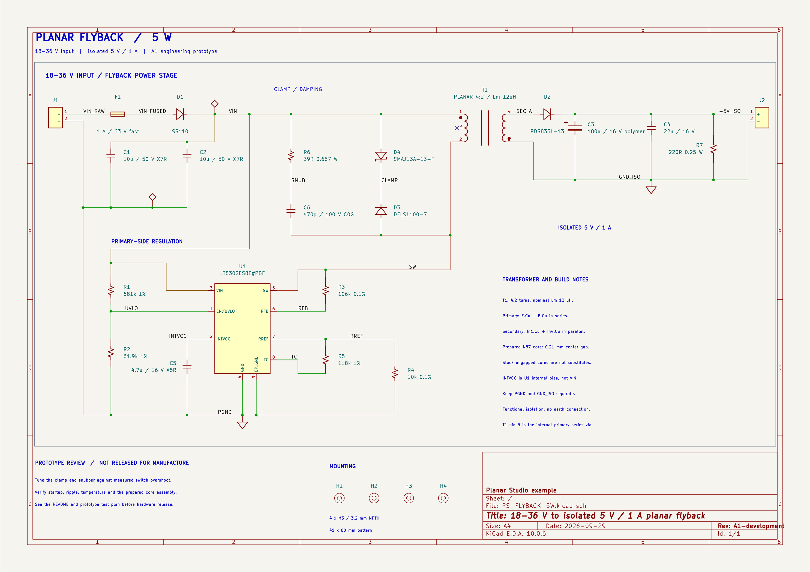
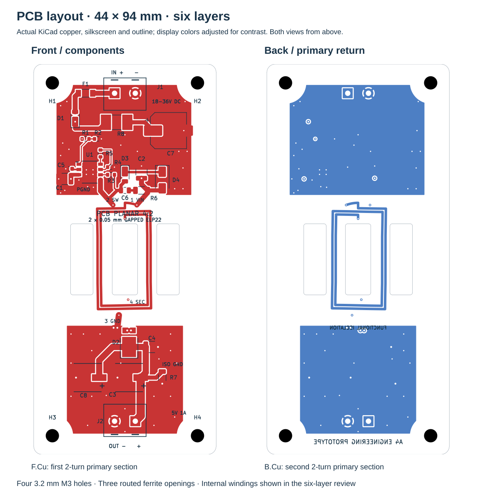

# 5 W planar flyback converter

**18–36 V DC → isolated 5 V / 1 A**, using an LT8302 and transformer windings built into a six-layer PCB. This example includes editable KiCad 10 files, the Planar Studio winding project, calculations and manufacturing review data.

> **A1 engineering prototype — unbuilt and untested.** The files pass the checks below; hardware performance and manufacturing feasibility remain unconfirmed. No design files were submitted to JLCPCB and no purchase was made.

[Download the complete A1 package](https://github.com/jonahsaunders/planar-studio/blob/codex/transformer-design-workflow/examples/PS-FLYBACK-5W-A1-review-package.zip?raw=true) · [Schematic](#schematic) · [PCB layout](#pcb-layout) · [Open in KiCad](#open-the-example) · [Audit and open issues](KISTACK-AUDIT.md)

| Electrical target | Physical design |
| --- | --- |
| 18–36 V DC input; isolated 5 V / 1 A output | 50 × 104 mm board; 1.6 mm nominal thickness |
| LT8302 primary-side regulation | Six copper layers; integral planar windings |
| 4:2 turns; nominal primary inductance 11.95 µH | Prepared N87 core pair; 0.21 mm center-leg gap |
| Separate primary and secondary returns | Four M3 holes: 3.2 mm NPTH, 41 × 80 mm pattern |

## Schematic

The input, controller, transformer and clamp share continuous drawn wiring. The snubber and avalanche clamp connect directly between **VIN** and **SW** beside T1. Primary and secondary returns have separate signal-ground symbols; neither denotes protective earth.

[](evidence/schematic.svg)

**Inspect:** [Zoomable schematic](evidence/schematic.svg) · [Editable KiCad schematic](kicad/PS-FLYBACK-5W.kicad_sch) · [Controller detail](evidence/audit/schematic-controller.png) · [Clamp detail](evidence/audit/schematic-clamp.png)

**Power-net naming:** `VIN` is the single protected input rail feeding T1, U1 and both clamp branches. `VIN_RAW` and `VIN_FUSED` are the distinct nodes before and after F1, upstream of D1. `INTVCC` is U1's internal bias supply; `+5V_ISO` is the isolated output. These names cannot be merged without changing the circuit. `PGND` and `GND_ISO` remain separate.

## PCB layout

The views below come from the actual KiCad copper, silkscreen and routed outline. Both use the same top-view coordinates, so the mounting holes and ferrite openings align. Silkscreen and outline display colors are darkened for readability; the manufacturing geometry is unchanged.

[](evidence/layout-overview.svg)

**Inspect:** [Front copper and silkscreen](evidence/board.svg) · [Back copper and silkscreen](evidence/board-back.svg) · [Component assembly drawing](manufacturing/assembly-top.svg) · [All six copper Gerbers](evidence/audit/gerber-copper-overview.png) · [Editable KiCad board](kicad/PS-FLYBACK-5W.kicad_pcb)

The front and back each carry a two-turn primary section, connected in series. In1.Cu and In4.Cu carry two-turn secondary sections in parallel. The center and two outer slots accept the prepared ferrite pair. The transformer winding reference file is separate from this complete converter board.

[Mounting dimensions and fastener clearance](manufacturing/MOUNTING.md) · [Core installation drawing](manufacturing/core-assembly.svg) · [Core assembly process](manufacturing/CORE-ASSEMBLY.md)

## Open the example

1. Download and extract the [A1 package](https://github.com/jonahsaunders/planar-studio/blob/codex/transformer-design-workflow/examples/PS-FLYBACK-5W-A1-review-package.zip?raw=true), or clone this branch.
2. Open `kicad/PS-FLYBACK-5W.kicad_pro` in **KiCad 10**. In the repository, this is under `examples/planar-flyback-5w/`. The schematic, placed/routed board, symbols and used footprints are included.
3. Open `report.html` locally for the illustrated engineering report. GitHub displays the HTML source; the previews above work directly on GitHub.
4. Import `planar-studio/T1.planar.json` into Planar Studio to inspect the winding design. Use this development branch with prepared-core support (commit `9210fce` or later); the published 1.3.0 plugin lacks that feature.

Existing files open without running the generators. `kicad/PS-FLYBACK-5W.kicad_pcb` is the complete converter; `planar-studio/T1-windings.kicad_pcb` is a winding geometry reference.

## Checks and remaining work

| Saved-design check | Result |
| --- | --- |
| KiCad electrical rules | 0 messages |
| Board rules / connectivity / schematic parity | 0 violations / 0 unconnected items / 0 parity issues |
| Schematic-to-board comparison | 54 logical pins agree with 55 numbered pads |
| Drawn-wire continuity | VIN, SW, PGND, +5V_ISO and GND_ISO each connect physically on the sheet; the five nets stay distinct |
| Winding copper | Four polygon terminal sets and 19,229 centerline samples checked |
| Electronic assembly data | 21 BOM/CPL references agree |
| Fabrication exports | Six copper Gerbers; 27 plated holes and four M3 NPTH holes |

[Validation record](VALIDATION.md) · [KiStack audit](KISTACK-AUDIT.md) · [Independent checks](evidence/independent-checks.json) · [Schematic revision comparison](evidence/audit/schematic-layout-checks.json)

These checks establish file consistency and the geometry tested, not working hardware. Prototype measurements must establish regulation, ripple, switch overshoot, startup, overload, inductance under bias, core/fringing losses and temperature. The bulk-only ripple estimate is about 100 mV with little margin. The standalone cycle model is not a closed-loop LT8302 simulation, and the assumed 75% efficiency is not a measured result.

The proposed supplier must accept the stack, sourcing, core preparation and retention/installation process. **Stock ungapped cores are not substitutes** for the prepared pair. Several resistor lines still need sourcing confirmation, and complete 3D fit remains unverified because custom body models are incomplete. Functional low-voltage isolation only; no mains or safety-isolation rating is claimed.

[Prototype test plan](manufacturing/PROTOTYPE-TEST-PLAN.md) · [Fabrication requirements](manufacturing/FABRICATION.md) · [Unsent feasibility-request template](manufacturing/JLCPCB-REVIEW-REQUEST.md)

## File guide

| Folder / file | Use |
| --- | --- |
| `kicad/` | Editable project, schematic, complete board and local libraries |
| `planar-studio/` | Importable T1 project, winding artwork and model exports |
| `manufacturing/` | Gerbers/drills, BOM/CPL, stack, via schedule, mounting/core instructions and test plan; review only |
| `evidence/` | Schematic/layout previews, ERC/DRC, geometric checks, calculations and waveform data |
| `parts.json`, `sources/references.md` | Component identities and source links |
| `scripts/` | Reproducible CAD, calculation, validation, layout-preview and packaging generators |
| `report.html` | Illustrated report to open locally |
| `SHA256SUMS.json` | Integrity hashes for the example files |


## Rebuild and package

Existing generated files open without running any scripts. To reproduce the design, use Node.js and **KiCad 10's Python with `pcbnew`**, plus the matching `kicad-cli`. Version 10.0.6 was used for the recorded validation. No third-party Python packages are required. Commands below run from this example directory.

```sh
python scripts/check-manifest.py
python scripts/rebuild.py
python scripts/package-project.py
```

Here `python` must be the KiCad Python interpreter for `rebuild.py`. On Windows, for example:

```powershell
& 'C:\Program Files\KiCad\10.0\bin\python.exe' scripts/rebuild.py --kicad-cli 'C:\Program Files\KiCad\10.0\bin\kicad-cli.exe'
```

On other platforms, use a Python interpreter configured to import KiCad's `pcbnew`; pass `--kicad-cli /path/to/kicad-cli` if it is not on PATH. The board generator uses bundled footprints. Only if one is missing does it need `KICAD10_FOOTPRINT_DIR` or `KICAD_FOOTPRINT_DIR` pointing to installed stock footprints.

Rebuild overwrites generated CAD, exports, calculations, previews and evidence, then refreshes the integrity manifest. It stops on ERC/DRC violations or independent-check failures. Save manual CAD changes before rebuilding. Geometry and electrical checks are repeatable; UUIDs, timestamps and export ordering need not be byte-identical. Review the resulting drawings and changed files before sharing revised manufacturing data.

The packager writes a complete review folder and ZIP to repository `dist/examples/`; it sends nothing. It requires a fresh destination to avoid silently retaining stale files. Use `--output /path/to/fresh-directory` for another destination. After design changes, rerun the additional visual audit described in `KISTACK-AUDIT.md`; stored audit pictures and findings are snapshots. In an extracted standalone review package, set `PLANAR_STUDIO_ROOT` to a checkout of this branch before rebuilding, and pass `--output` explicitly when packaging.

Changes to stack, terminals, footprints or components require regeneration and renewed engineering checks before reusing manufacturing exports. A0 did not identify the named “I2CJack” workflow. A1 explicitly uses the subsequently requested American Embedded KiStack audit skills, pinned in `KISTACK-AUDIT.md`.

## Attribution

Custom example files and Planar Studio are MIT licensed; see [LICENSE](LICENSE). Standard KiCad footprints are by the KiCad library contributors and redistributed under CC BY-SA 4.0 with KiCad's design exception; see [footprint license](kicad/Flyback.pretty/LICENSE.md). Vendor names and part identifiers establish design provenance, not supplier endorsement or availability.

The additional American Embedded mounting footprint is CC BY 4.0; see [its attribution](kicad/amemb-MountingHole.pretty/LICENSE.md). The unmodified KiStack placement converter retains [its upstream license](scripts/vendor/KISTACK-LICENSE.txt).
