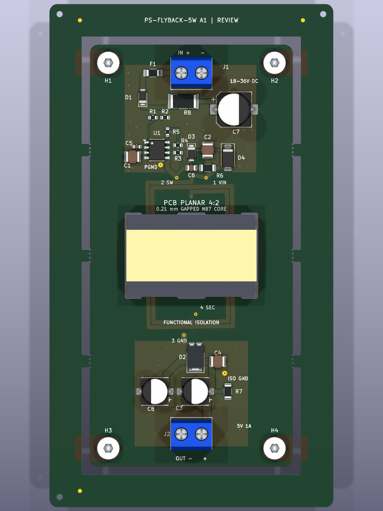

# Standard-assembly panel — A1 review

One 50 × 104 mm converter sits in a **70 × 124 mm** panel. Eight-millimetre rails and a 2 mm routing gap provide the width needed for JLCPCB Standard assembly. Six 3 mm side tabs carry 0.5 mm mouse-bite drills at 0.8 mm spacing. No tabs enter the core slots or connector ends. The frame stays continuous.

Three 1.5 mm tooling holes and three 1 mm fiducials on each face occupy the rails. Tooling has stencil apertures; fiducials have no paste. Copper and mask diameters are both 1 mm at fiducials. The core and mounting hardware in the render are illustrative: install the prepared core after soldering and depanelization.

Use this **complete matching set** when submitting the panel for factory review:

- [Panel Gerbers and drills](../build/panel-A1/PANEL-GERBERS-REVIEW-ONLY.zip)
- [Panel electronic BOM](../build/panel-A1/BOM-JLCPCB.csv)
- [Panel placement file](../build/panel-A1/CPL-JLCPCB.csv)
- [Panel selective fill/cap schedule](../build/panel-A1/via-fill.csv)
- [Editable panel](../build/panel-A1/PS-FLYBACK-5W-panel.kicad_pcb), [checks](../build/panel-A1/panel-checks.json) and [resolved KiKit settings](../build/panel-A1/resolved.json)

The datum is the panel's lower-left corner; X is right and Y is up. Board placements are translated by +10 mm in X and Y from the single-board export. Connector centroids retain their explicit correction. The BOM contains only the 24 electronic placements; rails, holes, fiducials, winding and core are excluded. **Do not mix panel Gerbers with the single-board placement/via files.**

All original footprint pad nets, sizes, drills and orientations are checked against the source. Panel DRC reports zero violations and unconnected items. There are 66 filled/capped electrical interlayer holes; all connector, tooling, mouse-bite and mounting holes remain open. Three internal routed core openings are preserved.

Generate using `scripts/build-panel.py` with KiCad 10 Python and KiKit 1.8.1. The preset is `manufacturing/panelize.json`; source CAD is not modified. Approve handling, breakaway method, tooling, fiducial recognition, stencil and through-hole soldering with JLCPCB. Support the board during tab removal; assess depanelization stress on MLCCs before accepting the process.
