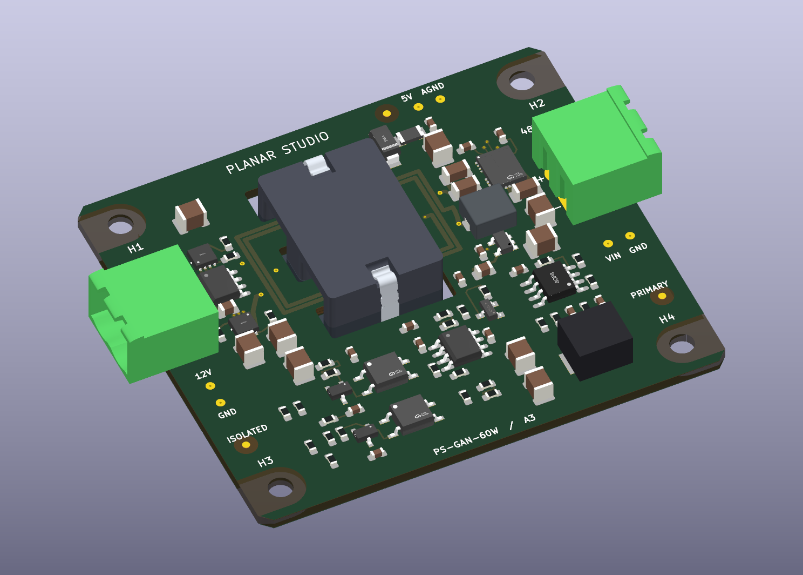
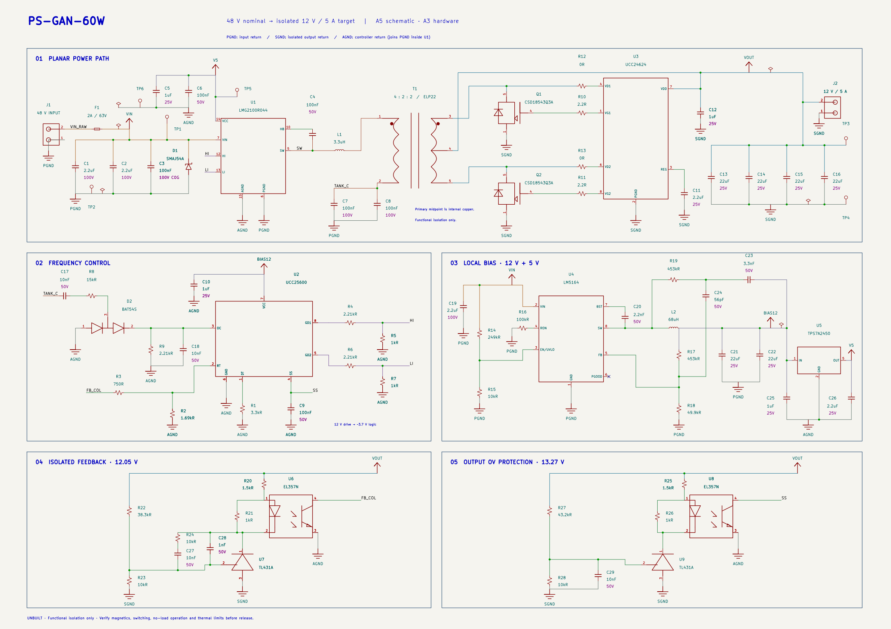

# PS-GAN-60W — planar GaN LLC example

An editable KiCad 10 prototype targeting **48 V nominal input and isolated
12 V / 5 A output**, using an integrated GaN half bridge and PCB transformer.
Initial input range: **46–50 V**. **Unbuilt and untested; 60 W is a target.**



## Schematic and layout



A5 separates VIN and AGND labels from neighboring nets, gives VD1 and VG1
their own clear routes, and places C11 vertically below REG. J2 faces the output
rail so its positive and return wires do not cross. Probe pads, power flags,
R16 and adjacent component fields have clear space around them. OC, bias and
feedback paths retain direct local wiring and zero four-way connections.

**A5 schematic / A3 hardware corrects an electrical error in earlier packages:**
R16 now connects LM5164 RON to PGND, as required by TI, instead of VIN.
The PCB removes the old VIN spur and adds a ground via at R16. Use this revision
in place of previous prototype files. The 100 kΩ value remains unchanged.
D1 now shows the correct unidirectional TVS symbol, with its cathode at VIN;
its physical polarity was already correct. Optocouplers have emitter arrows.

Part identifiers, values, placement, outline and transformer artwork are retained.
See the [intentional-change comparison](evidence/A5-change-audit.json),
[datasheet pin review](evidence/datasheet-pin-review.json),
[schematic geometry checks](evidence/schematic-geometry.json) and
[readability check](evidence/readability-audit.json).

The outline shrinks from 80 × 58 to **64 × 56 mm**, about **23% less PCB area**,
while preserving the winding geometry and all-top electronics. This compares
outline bounding areas, not complete assembly volume. Headers overhang the
edges; mating plugs, wiring and service clearance add to the envelope.


- **64 × 56 mm** chamfered board; eight copper layers, nominal 1.6 mm thickness.
- Four **3.2 mm M3 holes** reuse the actual exposed-substrate edge footprint from
  the flyback example: 6.4 mm mask openings and 10 mm copper exclusions on all
  layers. The **55 × 47 mm** pattern is adapted to this outline; it is not the
  flyback's 35 × 85 mm pattern.
- Two horizontal **5.08 mm pluggable screw-terminal ports** face opposite edges.
  Removable plugs accept bench leads without soldering; plugs are listed separately.
  J1 is input, J2 is output; **pin 2 = positive, pin 1 = return** on both.
- All **75 purchased components are top-mounted**: 73 SMT and two through-hole
  connectors. The ferrite halves straddle the board. Six bare test pads and
  three optical fiducials are PCB features, excluded from the assembly BOM.
- C15 is placed near the upper rectifier. Local GaN decoupling and winding
  connections stay compact; return pours extend into the connector margins.

The [MIT PER design study](PER-DESIGN-STUDY.md) records the photographs, papers
and specific design decisions. This example has no MIT affiliation or endorsement.

## Circuit and magnetics

LMG2100R044 → 3.3 µH resonant inductor → 4:2:2 planar transformer → silicon
synchronous rectification. UCC25600 provides frequency control, UCC24624 drives
the secondary MOSFETs, and isolated feedback includes a separate OVP path.
LM5164 and TPS7A2450 generate local bias rails.

The winding stack is P / S-A / S-A / routing / routing / S-B / S-B / P, with
70 µm copper requested on every layer. Parallel secondary layers reduce DC
resistance. Two TDK ELP22 N87 halves, each with a 0.05 mm gap, and two clips are
the separate DigiKey items. Measured inductance, leakage and loss are still needed.

First-harmonic calculations find nominal full-load operating points around
161–192 kHz over the initial input range. They do not prove startup, ZVS,
regulation, thermal performance or no-load operation.

## Open and review

- [Native KiCad project](kicad/PS-GAN-60W.kicad_pro), with local symbols, footprints
  and models; [schematic PDF](Schematic.pdf).
- [Interactive local review](Review.html): open after downloading the example.
  GitHub does not execute this HTML preview.
- [Copper-layer PDF](PCB-layers.pdf), [validation record](VALIDATION.md) and
  [mechanical dimensions](mechanical.json).
- [JLCPCB sourcing and assembly notes](JLCPCB-SOURCING.md),
  [priced BOM](sourcing/Electronics-BOM-review.csv) and
  [prototype manufacturing files](manufacturing-prototype/READ-BEFORE-ORDER.txt).

The CAD checks pass with zero ERC/DRC violations, zero unconnected items and
zero schematic-parity issues. Factory DFM, exact stack, placement preview,
connector/core assembly and electrical/thermal qualification remain open.
This is an engineering example, not a production-qualified converter.

## Reproduce the checks

Run with Python in UTF-8 mode. KiCad's bundled Python supplies `pcbnew`.

```text
python -X utf8 scripts/export_review.py /path/to/kicad-cli
python -X utf8 scripts/audit_device_pins.py
python -X utf8 scripts/audit_schematic.py
python -X utf8 scripts/audit_readability.py
python -X utf8 scripts/audit_windings.py
python -X utf8 scripts/audit_mechanical.py
python -X utf8 scripts/final_audit.py
```

`export_review.py` stops before manufacturing export if ERC or DRC fails.
`engineering_review.py` needs NumPy. `rebuild_board.py` recreates the canonical
board from the included local footprints, placement definitions, manual routes
and mechanical features; it overwrites PCB placement/routing and project rules.
The native schematic is the editable circuit source. redraw_schematic.py
recreates the A5 presentation from circuit.json and the local symbol library;
it overwrites schematic edits, so regenerate only intentionally. It and
audit_schematic.py require the sexpdata package. audit_readability.py also needs
pypdfium2. Capacitor ratings are retained in the visible Voltage field and both BOMs.

After intentionally regenerating the schematic, run update_net_aliases.py with
the kicad-cli path, then rebuild_board.py with KiCad Python before exporting.
The alias step matches complete connected-pin sets and refuses topology changes;
it keeps automatically named internal nets consistent with the PCB.

`planar-studio/T1.planar.json` is the **four-section seed**, not the complete
six-winding-layer implementation. `T1-artwork.json` and the native winding/board
files contain the added parallel secondary layers. To regenerate the standalone
winding files, run `node scripts/regenerate_magnetics.mjs /path/to/planar-studio`
against source commit `71f6f4db9c1a7172bddca8c9c934d3a8ece2a481`. This does not
update the main board automatically.

KiStack's schematic, BOM, PCB, symbol/footprint and export workflows were used.
Official manufacturer and JLCPCB/LCSC sources replaced unavailable parts
connectors with the user's approval. See [third-party notices](THIRD-PARTY-NOTICES.txt).
